## V1: A Visual Query Language for Property Graphs

Copyright © 2017-2021 [Lior Kogan](https://www.linkedin.com/in/liorkogan) (koganlior1 [at] gmail [dot] com)

---

The V1 language, all the content of [https://github.com/LiorKogan/V1](https://github.com/LiorKogan/V1), and all the content of [http://v1.ms/](http://v1.ms/) are licensed under the [CC BY-NC-SA 4.0 license](https://creativecommons.org/licenses/by-nc-sa/4.0/). Commercial license and software tools are also available.

This page contains the description and the specifications of the V1 language. This content is periodically released in [arXiv](https://arxiv.org/abs/1710.04470).

V1 is named after the primary visual cortex in our brain, which is also known as visual area one (V1).

V1 is dedicated to my ancestors all the way back, and to their descendants all the way forth.

Feedback, questions, corrections, and suggestions are welcome.

---

## Table of Contents

- [Introduction](#introduction)
- [The Property Graph Data Model](#the-property-graph-data-model)
- [The Property Graph Schema](#the-property-graph-schema)
- [Patterns and Pattern Languages](#patterns-and-pattern-languages)
- [A Song of Ice and Fire](#a-song-of-ice-and-fire)
- [V1 Basics](#v1-basics)
- [Expressions and Expression Constraints](#expressions-and-expression-constraints)
- [Data Types, Operators, and Functions](#data-types-operators-and-functions)
- [Quantifiers](#quantifiers)
- [Entity-Tags](#entity-tags)
- [Negator](#negator)
- [Relationship/Path-Negator](#relationshippath-negator)
- [Combiner](#combiner)
- [Chains, Horizontal Quantifiers, and Horizontal Combiner](#chains-horizontal-quantifiers-and-horizontal-combiner)
- [Latent Pattern-Entities](#latent-pattern-entities)
- [Optional Components](#optional-components)
- [Untyped Entities](#untyped-entities)
- [Entity Type-Tags](#entity-type-tags)
- [Untyped Relationships](#untyped-relationships)
- [Relationship Type-Tags](#relationship-type-tags)
- [Null Entities](#null-entities)
- [Paths](#paths)
- [Shortest Paths](#shortest-paths)
- [Path Patterns](#path-patterns)
- [Referencing Expression-Tags](#referencing-expression-tags)
- [Aggregators](#aggregators)
  - [A1 Aggregator](#a1-aggregator)
  - [A2 Aggregator](#a2-aggregator)
  - [A3 Aggregator](#a3-aggregator)
- [Min/Max Aggregators](#minmax-aggregators)
  - [M1 Aggregator](#m1-aggregator)
  - [M2 Aggregator](#m2-aggregator)
  - [M3 Aggregator](#m3-aggregator)
  - [R1 Aggregator](#r1-aggregator)
- [Aggregator Chains](#aggregator-chains)
- [Aggregator Sequences](#aggregator-sequences)
- [Aggregator Rules](#aggregator-rules)
- [Extended Aggregators](#extended-aggregators)
  - [Extended A1 Aggregator](#extended-a1-aggregator)
  - [Extended A2 Aggregator](#extended-a2-aggregator)
  - [Extended A3 Aggregator](#extended-a3-aggregator)
  - [Extended M1 Aggregator](#extended-m1-aggregator)
  - [Extended M2 Aggregator](#extended-m2-aggregator)
  - [Extended M3 Aggregator](#extended-m3-aggregator)
  - [Extended R1 Aggregator](#extended-r1-aggregator)
- [Multivalued Functions and Expressions](#multivalued-functions-and-expressions)
- [Application: Spatiotemporality](#application-spatiotemporality)

## Introduction

The _property graph_ is an increasingly popular data model. Pattern construction and pattern matching are important tasks when dealing with property graphs. Given a property graph schema _S_, a property graph _G_, and a query pattern _P_, all expressed in some language _L=_(_LS, LG, LP, LR_), _pattern matching_ is the process of finding, merging, and annotating subgraphs of _G_ that match _P_. The syntaxes of sublanguages _LS_, _LG_, _LP_, and _LR_ define what and how symbols may be combined to create well-formed schemas, graphs, patterns, and query results, respectively. A semantics of _LP_ is a mapping (_S, G, P_) → _R_: which subgraphs of _G_ match _P_ and how to merge and annotate them. Expressive pattern languages support topological constraints, property value constraints, negations, quantifications, aggregations, and path semantics. _Calculated properties_ may be defined for vertices, edges, and subgraphs, and constraints may be imposed on their evaluation result.

Many query posers are professionals (e.g., researchers, analysts, or investigators) who construct patterns as part of their daily work (e.g., investigative analytics). Such domain experts would like to construct patterns with minimal effort, minimal trial and error, and in a manner that is coherent with the way they think. The ability to express patterns in a way that is aligned with their mental processes is crucial to the flow of their work and to the quality of the insights they can draw. Many of them will not use textual property graph query languages (e.g., [Gremlin](https://arxiv.org/abs/1508.03843), [GSQL](https://arxiv.org/abs/1901.08248), [Cypher](https://dl.acm.org/citation.cfm?id=3190657), [PGQL](https://dl.acm.org/citation.cfm?id=2960421), [G-CORE](https://arxiv.org/abs/1712.01550), and the proposed [GQL](https://gql.today/)) either because it can be too hard for someone with little or no programming or scripting skills, or because it requires them to spend too much time on the technicalities and distracts them from their line of inquiry. As a result, many professionals are forced to use only a predefined set of query templates or work in concert with technical experts. Both solutions are far from satisfying. 

Since the capabilities of the human visual system with respect to pattern perception are remarkable, it is a matter of course that query patterns were to be expressed visually. Indeed, five of the abovementioned languages use 'ASCII-art syntax' for expressing topological constraints. Needless to say, this type of 'visualization' is quite limited. While the use of ASCII-art declined during the 1990s in favor of graphical images, query languages began to adopt ASCII-art only recently. Visual (graphical, diagrammatic) query languages have the potential to be much more 'user-friendly' than their textual counterparts in the sense that patterns may be constructed and understood much more quickly and with much less mental effort. Given a schema, interactive tools can allow query posers to construct valid patterns with minimal typing. A long-standing challenge is to design a visual query language that is generic, has rich expressive power, and is highly receptive and productive. V1 attempts to answer this challenge.

V1 is a declarative visual pattern query language for schema-based property graphs. V1 supports property graphs with mixed (both directed and undirected) edges, multivalued and composite properties, and _null_ property values. V1 supports temporal data types, operators, and functions and can be extended to support additional data types, operators, and functions (one spatiotemporal model is presented). V1 is generic, concise, has rich expressive power, and is highly receptive and productive.

## The Property Graph Data Model

The term _property graph_ refers to both a mathematical structure and a data model; both are described below.

### Mathematical Structure:

A [_graph_](https://en.wikipedia.org/wiki/Graph_(discrete_mathematics)) is an ordered quintet _G_ = (_V_, _E_, _A_, _ψₑ_, _ψₐ_) consisting of a nonempty set _V_ whose elements are called [_vertices_](https://en.wikipedia.org/wiki/Vertex_(graph_theory)) (_nodes_, _dots_, _points_), a set _E_ whose elements are called _undirectred edges_ (_undirectred links_, _undirectred lines_), a set _A_ whose elements are called _directred edges_ (_directred links_, _directred lines_, _arcs_, _arrows_), an _incidence function_ _ψₑ_ mapping every element of _E_ to an unordered pair of vertices, and an _incidence function_ _ψₐ_ mapping every element of _A_ to an ordered pair of vertices.

An [_undirected graph_](https://en.wikipedia.org/wiki/Graph_(discrete_mathematics)#Graph) is a graph in which _A_ ≔ _∅_. A [_directed graph_](https://en.wikipedia.org/wiki/Directed_graph) (_digraph_) is a graph in which _E_ ≔ _∅_. A [_mixed graph_](https://en.wikipedia.org/wiki/Mixed_graph) is a graph in which both _E_ and _A_ are allowed to be nonempty.

A [_loop_](https://en.wikipedia.org/wiki/Loop_(graph_theory)) is an edge (directed or undirected) connecting a vertex to itself. [_Multiple edges_](https://en.wikipedia.org/wiki/Multiple_edges) (_parallel edges_) are two or more undirected edges connecting the same unordered pair of vertices or directed edges connecting the same ordered pair of vertices. A _simple graph_ is a graph in which multiple edges and loops are not allowed. A [_pseudograph_](http://mathworld.wolfram.com/Pseudograph.html) is a graph in which multiple edges and loops are allowed.

An _attributed graph_ is a graph in which vertices and/or edges are annotated with attributes or sets of attributes (i.e., _multi-attributed graph_). Attributes can be nominal, ordinal, key-value pairs, and so on. (The term _attributes_ is sometimes used to refer only to key-value pairs, while _labels_ is used to refer to nominal attributes).

A _property graph_ (_PG_, _labeled property graph_, _LPG_) is a multi-attributed mixed pseudograph in which:

- Each vertex has an attribute called _label_ (_vertex-labeled graph_). Similarly, each edge has an attribute called _label_ (_edge-labeled graph_). The set of vertex-labels and the set of edge-labels are disjoint.

- Each vertex and each edge has a set of attributes called _properties_. Each property is an ordered pair: the property's name and the property's value. For each vertex and each edge, the property names are pairwise distinct.

### Data Model:

A _data element_ (i.e., _datum_) is an atomic unit of data. A _data model_ specifies the structure and the semantics of data elements and the relations between data elements. A data model consists of:

- A conceptualization: a set of _concepts_ (e.g., _entity_, _relationship_, _feature_) used for defining data elements and their relations. The semantics of the concepts may be described, for example, using ontological concepts (e.g., _particular_, _type_, _universal_, _composition_, _relation_, _action_, _quality_).
- A representation: a _structure_ (e.g., mathematical, diagrammatic) used for representing data elements and their relations.

The _property graph data model_ defines the following **concepts**:

-	An _entity_ is a physical, conceptual, virtual, or fictional particular (e.g., a certain person, guild, or dragon).

-	A (_binary_) _relationship_ is an _association_ or an _interaction_ between a pair of entities or between an entity and itself. Each relationship is either _directional_ (_unidirectional_, _asymmetric_) (e.g., an _owns_ relationship between a _Person_ entity and a _Horse_ entity, an _offspring_ relationship between two _Person_ entities) or bidirectional (_non-directional_, _symmetric_, _reciprocal_) (e.g., a _sibling_ relationship between two _Person_ entities).

-	An _action_ is an action _of_ an entity (e.g., _eats_ for a _Person_ entity) or an action _on_ or _against_ an entity (e.g., _accused_ for a _Person_ entity), when no other [known or relevant] entities are concerned. An action may also represent a state of an entity (e.g., _sleeps_ action for a _Person_ entity) or a state-change (e.g., _falls asleep_ for a _Person_ entity).

- We will use the term _element_ to refer to an entity, a relationship, or an action.

- Each element has a set of _features_ (_characteristics_). Each feature has a name (e.g., _birth date_ for a _Person_ entity, _timeframe_ for an _owns_ association, _timeframe_ for a _sleeps_ action) and a value, for example, _weight_= 450. For each element, the feature names are pairwise distinct.

- Each element has a single _type_. A property graph is a _heterogeneous graph_; it may contain entities of multiple types (_multi-modal graph_), relationships of multiple types (_multi-relational graph_), and, optionally, actions of multiple types. Elements may have multiple features (_multi-featured graph_).

  Entities of the same type are _semantically homogeneous_. The same is true also for relationships and for actions. Types can be assigned based on many universals (qualities), e.g., _person_ entities, _red_ entities, _owner_ entities. Many times types are assigned in accordance with the following guidelines:
  - _Repetition of existence_: there are multiple entities of the same type, multiple relationships of the same type,  and multiple actions of the same type.
  - _Repetition of features_: entities of the same type have features of the same types. The same is true also for relationships and for actions.
  - _Repetitions of actions_: entities of the same type 'have' actions of the same types.
  - _Repetition of relationships_: pairs of entities of the same pair of entity-types have relationships of the same types.
  - _Type constancy_: an entity's type, a relationship's type, and an action's type do not change over time. 
  - _Value inconstancy_: feature values may change over time.

  Note that the property graph data model does not define types of entities, relationships, and actions, nor it defines sets of features. Such definitions may be specified as part of a property graph schema (see next section).

The property graph data model defines the following **structure**:

  - All available data elements are organized in a single property graph.
  - A _null vertex_ is a propertyless vertex with a null label. Each null vertex is connected to exactly one edge. An edge between two null vertices is not allowed.
  - Any vertex, except null vertices, represents an entity. The vertex's label is an integer or a nonempty string identifying the _entity's type_ (e.g., _Person_, _Guild_, _Dragon_).
  - A graph edge, where both vertices are not null vertices, represents a binary relationship. 
  - A graph edge, where one vertex is a null vertex, represents either

    - an entity's action (e.g., _sleeps_ action for a _Person_ entity), or
    - a relationship between an entity and a nonspecific entity. Sometimes, an entity is unknown or unimportant, but the existence of a relationship and the values of the relationship’s properties - are important. For example, we may know that a given horse was owned in given timeframes, but we do not know or care who owned it. Still, we want to be able to model such data.

  - The edge's label is an integer or a nonempty string identifying the _relationship's type_ (e.g., _owns_, _member of_) or the _action's type_ (e.g., _sleeps_).
  - A directed graph edge represents a directional relationship or action, while an undirected edge represents a bidirectional relationships or action.
  - Properties and subproperties represent features and subfeatures of entities (e.g., _name_ property and _first name_ subproperty for a _Person_ entity), relationships (e.g., _timeframe_ property for an _owns_ association), and actions (e.g., _timeframe_ for a _sleeps_ action). For each entity, relationship, and action, property names are pairwise distinct strings or integers, each identifying the feature's name, and each property value represents the feature's value.
  - Each feature value is represented using one of the _property data types_ supported by the model. There is, however, no standard definition of which data types the model should support. In this paper, we will use the following:

    - The model defines a set of _basic data types_ (e.g., _string_, _integer_, _float_).
    - A _multivalue_ is a set, a bag, or a list of values. All values are of the same basic data type (e.g., each value is a _string_), the same multivalue type (e.g., each value is a set(_string_)), or the same composite type (e.g., each value is a {_first_: _string_, _last_: _string_} composite).
    - A _composite value_ is a set of (name, value) pairs in which the names are pairwise distinct strings or integers identifying the subfeatures names, and each value is of a basic data type, a multivalue type, or a composite type.

    A _basic property_ is a property whose value is of a basic data type. A _multivalued property_ is a property whose value is a multivalue, e.g., _titles_: _set_(_string_) = {"Her Majesty", "Her Royal Highness"}. A _composite property_ is a property whose value is composite, e.g., _name_: (_first_: _string_ = "Brandon", _last_: _string_ = "Stark"). Each member of a composite property is called a _subproperty_.

  - _null_ is a valid value for each _nullable_ property and subproperty, regardless of its data type. _Null-valued_ [sub]property indicates that a [sub]feature value is not specified.

    Several different interpretations can be associated with a _null_ value. Following the terminology introduced by [Codd](https://dl.acm.org/doi/10.1145/16301.16303) and adopted by many authors, a _null_ value is either
    - _Applicable missing_ – at present, a value is applicable (applies to the particular entity, relationship, or action) but unknown (whatever the reason, the graph does not have the value). E.g., the temperature 1000 years ago today; a phone number of a person who owns a phone, but the number is unknown; an answer to a question – when the questionee refused to answer.
    - _Inapplicable_ - at present, no value is applicable. E.g., the temperature tomorrow, previous citizenship when there is none, direct manager of the CEO, new hire's not-yet-assigned employee ID, a phone number of a person who does not own a phone, an answer to a question – when the question was not posed to the questionee.

    [Zaniolo](https://www.sciencedirect.com/science/article/pii/0022000084900801) proposed a third basic interpretation of _null_ values:

    - _No information_ – at present, the applicability of the unspecified value is unknown. E.g., a person's phone number – when it is unknown whether the person owns a phone; an answer to a question – when it is unknown if the question was posed to the questionee.
  
    Codd, Zaniolo, and many others proposed using two or more types of _null_ instead of a 'generic' _null_, but this approach remains mainly theoretical. In practice, _null_ values often have no consistent semantics. For a _birth date_ property, a _null_ value would likely represent an unknown birth date, but for a _death date_ property, a _null_ value may represent that the date on which the person died is unknown (_applicable missing_), that the person is still alive (_inapplicable_), or that it is unknown if the person is still alive (_no information_).

    Though _null_ value semantics is not usually defined as part of the data model, the semantics of operators and functions is well-defined for _null_ values. E.g., what is the result of (yesterday's date < person's death date) when the death date is _null_? Often, _null_ values represent _applicable missing_ and _no information_, while _magic values_ (e.g., "9999-12-31" for dates) represent _inapplicable_ values.
    
- With regard to the available data, each entity should be represented using one vertex. If new data proves that two or more vertices represent the same entity, these vertices should be merged. Similarly, each relationship or action should be represented using one edge.

- Any pair of vertices, except null vertices, should be _distinguishable_, which means that vertices' _identifiers_ should be pairwise distinct, or there should be no pair of vertices with identical type, property values, and relationships. Similarly, any pair of edges should be _distinguishable_, which means that edges' _identifiers_ should be pairwise distinct, or there should be no pair of edges with identical type and property values that connect the same pair of vertices or the same vertex and a null vertex. An _identifier_ is a set of properties and implementation indexes that collectively uniquely identifies the element.

_n_-ary relationships, where _n_ > 2, are not supported. However, this poses no practical limitation since any _n_-ary relationship, _n_ > 2, can be reframed as an entity and _n_ binary relationships. Consider, for example, a ternary relationship, where Person _A_ sells Horse _H_ to Person _B_. Instead, one can reframe this data as a _Sale_ entity _S_, a _seller_ relationship from _S_ to _A_, a _buyer_ relationship from _S_ to _B_, and a _sold_ relationship from _S_ to _H_.

The term _property graph_ was introduced by [Rodriguez](https://arxiv.org/abs/1006.2361) and [Neubauer](https://arxiv.org/abs/1004.1001), though other terms were used to describe similar data models. [Tsai and Fu's](https://ieeexplore.ieee.org/document/4310127) _attributed relational graph_ is a directed multigraph in which both nodes and edges have labels, and each label defines a set of numerical or logical attributes. [Shao et al.](https://ieeexplore.ieee.org/abstract/document/7953521) used the term _Heterogeneous graph_ for the same construct. [Gallagher](http://www.aaai.org/Papers/Symposia/Fall/2006/FS-06-02/FS06-02-007.pdf) used the term _data graph_ to refer to graphs in which vertices and/or edges may be typed and/or attributed. [Singh et al.](http://ieeexplore.ieee.org/abstract/document/4272051/) used the term _M*3_ (multi-modal, multi-relational, multifeatured) _network_ to refer to graphs with multiple entity-types, multiple relationship-types, and multiple descriptive features for nodes and edges. [Krause et al.](https://link.springer.com/chapter/10.1007/978-3-319-40530-8_10)  used the term _typed graph_ to refer to graphs with typed nodes, typed edges, and typed node properties.

Various extensions were proposed, including:
- Each vertex has a set of labels (_vertex multi-labeled graph_); entities are _multi-typed_
- [_Property hypergraphs_](https://link.springer.com/chapter/10.1007%2F978-3-319-26148-5_21) (_hyperedges_ represent _n_-ary relationships)
- Schema-level and data-level _metaproperties_ (properties of properties – e.g., units of measure, accuracy, reliability)
- [EPGM – Extended Property Graph Model](https://dbs.uni-leipzig.de/file/EPGM.pdf), in which _logical graphs_ consist of subsets of a shared set of vertices and a shared set of edges. In addition, logical graphs have types and properties.

## The Property Graph Schema

A _schema_ is a model for describing the structure of information in a certain domain using a certain data model. A _property graph schema_ defines the entity-types, the relationship-types, and the properties of thereof.

The property graph data model is _schema-optional_. Each property graph may be:
* _Schema-free_ (_schemaless_, _schema-independent_). A schema-free property graph neither defines nor enforces entity-types or relationships-types; each vertex and edge, regardless of its label, may have properties with any name and of any data type.
* _Schema-based_ (_schema-strict_, _schema-driven_, _schema-full_, _schema-dependent_). A schema-based property graph is a property graph conforming to a given schema.
* _Schema-mixed_ (_schema-hybrid_), where a schema is defined, but additional elements (e.g., additional properties) may be used.

It is much easier to define patterns when the information is presented consistently. For example, to match patterns such as _Any person who owns a white horse_, one would first:

* Define entity-types _Person_ and _Horse_ 
* Define a relationship-type _owns_ that holds from entities of type _Person_ to entities of type _Horse_
* For the _Horse_ entity-type, define a _color_ property with a nominal data type
* Ensure that all the information is structured accordingly

Though proposed property graph and property graph schema definitions have much in common (See [Angles](http://ceur-ws.org/Vol-2100/paper26.pdf), [Wu](https://arxiv.org/abs/1810.08755), [Hartig and Hidders](https://dl.acm.org/citation.cfm?id=3327964.3328495), and [Angles et al.](https://ieeexplore.ieee.org/document/9088985)), to date, there is neither a de jure nor a de facto standard definition (and hence, no standard property graph schema definition language). 

The following _property graph schema model_ (i.e., _property graph metamodel_) is assumed in this paper:

A _property graph schema_ is defined by:
* A finite set of user-defined data types (on top of the built-in data types)
  * _Categorical_ (_nominal_ and _ordinal_) data types (e.g., _gender_: nominal _{male, female}_)
  * _Multivalued property data types_ (e.g., _nicknames_: set(_string_))
  * _Composite data types_ (e.g., _name_ {_first_: _string_, _last_: _string_}
  * _Interval data types_ (e.g., _span_: interval(_date_))
* A finite set of entity-types. For each entity-type: 
  * A unique name
  * A set of properties. For each property: 
    * A unique name
    * A data type
    * For properties and subproperties with numeric data types, intervals of numeric data types, or multivalued numeric data types: an optional schema-level _units_ metaproperty representing units of measure (e.g., Kg, cm, seconds)
* A finite set of relationship-types. For each relationship-type: 
  * The relationship-type's directionality: directional or bidirectional
  * A unique name
  * A set of pairs of entity-types for which the relationship-type is applicable (e.g., _owns_: {(_Person_, _Horse_), (_Person_, _Dragon_)}. When a pair is of the same type (e.g., (_Dragon_, _Dragon_)), loops can be allowed or disallowed
  * A set of properties - similar to entity-types' properties
  
A predefined property-less entity-type _Null_ serves two purposes:
* Realizing actions: an action-type can be realized as a relationship-type that is applicable between some entity-type and the _Null_ entity-type. For example, a _sleeps_: {(_Dragon_, _Null_)} relationship-type realizes a _sleeps_ action-type for the _Dragon_ entity-type.
* Realizing relationships to unknown or unimportant entities: sometimes a real entity is unknown or unimportant, but the existence of a relationship and the values of the relationship's properties - are important. For example, we may know that a given dragon was owned in given timeframe, but we do not know or do not care who owned them. Still - we want to be able to store and query such information. _owns_: {(_Person_, _Dragon_), (_Guild_, _Dragon_), (_Null_, _Dragon_)} allows us to realize this.

Property graph schema definitions may vary in many aspects, including:

* Supported schema constraints (properties _uniqueness_ and _nullability_, _property value constraints_, _relationships cardinality constraints_, disallow loops for certain relationship-types, etc.)
* Supported ways to declare user-defined data types
* Properties may be either:
  * Defined globally and assigned to one or more entity/relationship-types, or
  * Defined per entity/relationship-type: different entity/relationship-types may have a property with the same name but with a different data type
* Directional relationship-types naming: 
  * A unique name for each direction (e.g., _owns_, _owned by_; _parent of_, _offspring of_), or
  * A unique name for only one direction
* Support of derivation (specialization) of entity-types, relationship-types, and property types

V1 can be utilized with most definitions with minimal changes. 

## Patterns and Pattern Languages

A _pattern_ defines a set of topological and property value constraints on property graphs. Each property (sub)graph either _matches_ the pattern or not. For some patterns, a given (sub)graph may match a pattern in more than one way.

When patterns are described in a natural language, they may be ambiguous, and the description may miss some nuances expressed in formal languages. Nevertheless, all the patterns below are described in English so that the reader may gain an intuitive understanding of their meaning. 

Here are two examples:

* _P1: Any person who owns at least five white horses_ (See Q101)

  _P1_ defines the set of (sub)graphs in which 

  - There is a vertex _p_ with a label _Person_
  - There are _n_ ≥ 5 vertices _h₁..hₙ_, each with a label _Horse_
  - Each of _h₁..hₙ_ has a _color_ property, and its value is _white_
  - There are relationships from _p_ to _h₁..hₙ_, each with a label _owns_

  Note that the pattern's description ignores temporal aspects. Maybe a person owned a horse, owns it, or will own it. Assuming that the owns relationship has a timeframe property, a more accurate description would be _Any person who has 'owns' relationships with at least five white horses_. Maybe we are looking for _Any person who currently owns at least five white horses_ or for _Any person who at some timepoint owned at least five white horses_. If, for example, a horse's color may change over time, or if a horse may turn into a unicorn, we might want to rephrase the pattern.

* _P2: Any person whose date of birth is between January 1, 970 and January 1, 980, who owns a white Horse, who owns a dragon whose name starts with 'M' and over the last month froze at least three dragons belonging to members of the Masons Guild_

  _P2_ defines the set of (sub)graphs in which 

  - There is a vertex _p_ with a label _Person_
  - _p_ has a _birthDate_ property of type _date_, and its value is between January 1, 970 and January 1, 980
  - There is at least one vertex _h_ with a label _Horse_
  - There is a relationship from _p_ to _h_ with a label _owns_
  - _h_ has a _color_ property, and its value is _white_
  - There is at least one vertex _d_ with a label _Dragon_
  - There is a relationship from _p_ to _d_ with a label _owns_
  - _d_ has a _name_ property with a value that starts with 'M'
  - There are _m_ > 3 vertices, _d₁..dₘ_, each with a label _Dragon_
  - There are relationships from _d_ to any of _d₁..dₘ_, each with a label _freezes_
  - Each of these relationships has a _tf_ property (stands for "time frame") with a _since_ subproperty whose value is in the range [_now_ - _months_(3) .. _now_]
  - There is a vertex _g_ with a label _Guild_
  - _g_ has a _name_ property, and its value is _Masons_
  - There are _n_ ≥ 1 vertices _q₁..qₙ_, each with a label _Person_
  - There are relationships from each of _q₁..qₙ_ to _g_, each with a label _member of_
  - There are relationships from each of _q₁..qₙ_ to one or more of _d₁..dₘ_, each with a label _owns_. Each of _d₁..dₘ_ is connected by at least one of these relationships

The terms _entity_ and _relationship_ denote both pattern elements and graph elements. When the context may be ambiguous, we use the terms _pattern-entity_ and _pattern-relationship_ to refer to pattern elements, and the terms _graph-entity_ and _graph-relationship_ to refer to graph elements.

Given a property graph schema _S_, a property graph _G_, and a query pattern _P_, all expressed in some language _L=_(_LS, LG, LP, LR_), _pattern matching_ is the process of finding, merging, and annotating subgraphs of _G_ that match _P_. The syntaxes of sublanguages _LS_, _LG_, _LP_, and _LR_ define what and how symbols may be combined to create well-formed schemas, graphs, patterns, and query results, respectively. A semantics of _LP_ is a mapping (_S, G, P_) → _R_: which subgraphs of _G_ match _P_ and how to merge and annotate them. 

Any valid subgraph that matches the pattern is called _an assignment_. We use _assignment to X_ where _X_ is a pattern-entity, a pattern-relationship or a set of thereof, to denote the graph-entity, the graph-relationship, or the set of thereof that matches _X_ as part of an assignment.

In the patterns given below, unless otherwise stated, each reported assignment should include the graph-entity assigned to each mentioned pattern-entity and the graph-relationship assigned to each mentioned pattern-relationship. Hence, any reported assignment to _P1_ should be composed of:
  
- A _Person_ graph-entity 
- Five or more _Horse_ graph-entities, each of which has a _color_ property, and its value is _white_
- The _owns_ graph-relationships between the _Person_ graph-entity to those _Horse_ graph-entities

Consider the following alternative patterns:

* _P1': Any person who owns at least five white horses. Report only the person_
* _P1'': Any person who owns at least five white horses. Report only the horses_
* _P1''': Any person who owns at least five white horses. Report the person and five of his horses_

A query may be:

* A decision query: does at least one assignment exist?
* A counting query: how many assignments exist?
* A counting-decision query: are there at least _k_ assignments?
* A reporting query:
  * Report [all / up to _k_] subgraphs of _G_, each is an assignment
  * Report subgraphs of _G_, each is a union of assignments, e.g., the union of all assignments with identical assignments to all entities (and different assignments to relationships)
  * Report a single subgraph of _G_, composed of the union of all assignments. This is sometimes preferred since it avoids combinatorial explosion for many queries (e.g., if a person owns ten white horses, any subset of five of the person's horses compose an assignment to P1'''). However, for some patterns, individual assignments cannot be deduced from their union.

Implementations may support one or more of the above.

V1 introduces the concept of _calculated properties_ - non-inherent properties of graph-entities, graph-relationships, and subgraphs, defined as part of a pattern. Each calculated property's evaluation result can be part of the reported query results, extending V1 capabilities beyond 'simple' pattern matching. For example, _The average number of horse ownerships per person_ - a calculated property of the set of all graph-entities of type _Person_ can be defined as part of a pattern. See Q356).

Pattern languages differ in many aspects, including:

* _Genericity_ - [general-purpose](https://en.wikipedia.org/wiki/General-purpose_language) (e.g., schema-driven) vs. [domain-specific](https://en.wikipedia.org/wiki/Domain-specific_language)
* _Pattern representation_ - _textual_ vs. _[visual](https://en.wikipedia.org/wiki/Visual_programming_language)_ (_graphical_, _diagrammatic_)
* _Receptivity_ and _Productivity_ (i.e., _readability_ and _writability_) - how intuitive and straightforward is it to understand existing patterns and to construct new ones
* _Conciseness_ - the fewness of symbols and symbol-types required for expressing patterns
* _Aesthetics_ - the quality of patterns being visually appealing
* _Declarative / Imperative_ - _[Declarative](https://en.wikipedia.org/wiki/Declarative_programming)_ languages describe patterns but do not specify how to match them. _[Imperative](https://en.wikipedia.org/wiki/Imperative_programming)_ languages describe patterns in terms of the steps required to match them on a given computational model. Languages may provide both declarative and imperative constructs.
* _[Expressive power](https://en.wikipedia.org/wiki/Expressive_power_(computer_science))_ - the breadth of patterns that can be expressed. 
  Unless a pattern language (declarative or imperative) is Turing-complete, there would always be computable patterns that cannot be expressed. 
  
There are always tradeoffs, especially between _receptivity and productivity_ and _expressive power_. Quoting Perlis' 54th and 55th [epigrams of programming](https://en.wikipedia.org/wiki/Epigrams_on_Programming): _"Beware of the Turing tar-pit in which everything is possible but nothing of interest is easy."_, and _"A LISP programmer knows the value of everything, but the cost of nothing."_ Perlis' 93rd and 26th epigrams are also worth quoting: _"When someone says 'I want a programming language in which I need only say what I wish done,' give him a lollipop."_, and _"There will always be things we wish to say in our programs that in all known languages can only be said poorly."_ Though these epigrams refer to programming languages, they are equally valid for property graph query languages.

## A Song of Ice and Fire

The following scenario, loosely based on [George R. R. Martin's _A Song of Ice and Fire_](http://www.georgerrmartin.com/bibliography/) will serve to demonstrate the language's expressive power.

The subjects of [Sarnor](http://awoiaf.westeros.org/index.php/Kingdom_of_Sarnor), [Omber](http://awoiaf.westeros.org/index.php/Kingdom_of_Omber), and the other kingdoms of the [known world](http://awoiaf.westeros.org/index.php/Known_world) love their [horses](http://awoiaf.westeros.org/index.php/Horse). There is one thing they adore even more - that is their [dragons](http://awoiaf.westeros.org/index.php/Dragon). They own dragons of ice and fire. Like all well-behaved dragons, their dragons love to play. Dragons always play in couples. When playing, dragons often get furious, fire at each other (fire breath), and freeze one another (cold breath). Dragons usually freeze one another for periods of several minutes. However, on occasion, when they are furious, they can freeze one another for periods of several hours. The subjects enjoy watching their dragons play. Fascinated by these magnificent creatures, they have composed myriads of scrolls detailing each fire breath and cold breath over the last thousand years. The kings of Sarnor and Omber regularly pose queries about their history. More than often, it takes the royal historians and royal analysts several days to come up with answers, during which the kings tend to get pretty impatient. Lately, the [high king of Sarnor](http://awoiaf.westeros.org/index.php/High_King_of_Sarnor) posed a very complex query. After waiting for results for more than two moons, he ordered the chief analyst to be executed. He then summoned his chief mechanics and ordered them to develop an apparatus that he could use to pose queries and get results quickly. 

The engineers started by collecting all queries posed by their master over the last few years. Then they constructed a property graph schema over which these queries can be expressed.

The schema was composed of the following entity-types (and their properties):

* ***Person***: _name_ {_first_: _string_, _last_: _string_}, _gender_: _nominal {male, female}_, _birthDate_: _date_, _deathDate_: _date_, _height_: _int_ [cm]
* ***Dragon***: _name_: _string_, _color_: _nominal {black, white, ...}_
* ***Horse***: _name_: _string_, _color_: _nominal {black, white, ...}_, _weight_: _int_ [Kg]
* ***Guild***: _name_: _string_
* ***Kingdom***: _name_: _string_

the following directional relationship-types (and their properties):

* ***owns***: {(_Person_, _Horse_), (_Person_, _Dragon_), (_Guild_, _Horse_), (_Guild_, _Dragon_)} - _df_: _dateframe_
* ***fires at***: {(_Dragon_, _Dragon_)} - _time_: _datetime_; no loops allowed
* ***freezes***: {(_Dragon_, _Dragon_)} - _tf_: _datetimeframe_; no loops allowed
* ***offspring of***: {(_Person_, _Person_)}; no loops allowed
* ***member of***: {(_Person_, _Guild_)} - _df_: _dateframe_
* ***subject of***: {(_Person_, _Kingdom_)}

and of the following bidirectional relationship-type (and its properties):

* ***friend of***: {(_Person_, _Person_)} - _since_: _date_; no loops allowed

_Person_'s name is a composite property. The _date_, _datetime_, _dateframe_, and _datetimeframe_ data types are defined in [Data Types, Operators, and Functions](#data-types-operators-and-functions).

The engineers then represented the whole known history using a property graph conforming to this schema.

## V1 Basics

The following sections describe the syntax and the semantics of the V1 language. We start with the basics, adding more language elements as we go along.

**Note:** V1 has two equivalent syntaxes for expressing patterns: A _visual syntax_ - described below, and a _textual syntax_ (JSON-based) - summarized [here](https://github.com/LiorKogan/V1/blob/master/JSON%20pattern.md). There is a bijective mapping between patterns expressed in these two syntaxes. Sample textual patterns are available [here](https://github.com/LiorKogan/V1/tree/master/JSON%20Patterns). A V1 schema for _A Song of Ice and Fire_ is available [here](https://github.com/LiorKogan/V1/blob/master/Dragons%20Schema.json).

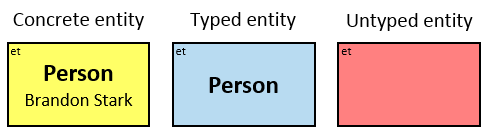

Patterns are generally read from left to right. Each pattern starts with **a small black diamond**, denoting the pattern start. The most straightforward patterns are structured as a sequence of rectangles, where consecutive rectangles are connected with an arrow or a line.

Yellow, blue, and red rectangles represent _concrete_, _typed_ and _untyped_ entities, respectively. The terms _concrete entity_, _typed entity_, and _untyped entity_ refer to pattern entities only (and not to graph entities).

**A yellow rectangle** represents a _concrete entity_: a specific person, a specific horse, etc. A concrete entity has a single assignment - a specific graph-entity. The text inside the rectangle denotes the entity-type and the value of a _visualization expression_ defined for this entity-type. For example, the visualization-expression for the _Person_ entity-type may be: _name.first_ ∥ ' ' ∥ _name.last_ and its value, for a specific graph-entity, would be 'Brandon Stark'.

**A blue rectangle** represents a _typed entity_: The text inside the rectangle denotes an entity-type. Only graph-entities of this type may be assigned to the pattern-entity. 

**A red rectangle** represents an _untyped entity_: Graph-entities of different types may be assigned to an untyped entity (subject to _type constraints_. See [Untyped Entities](#untyped-entities)).

Two consecutive rectangles can be connected with:

* A horizontal **black arrow**, representing a _directional typed relationship_,
* A horizontal **black line**, representing either a _bidirectional typed relationship_ or a directional typed relationship for which either direction is acceptable,
* A horizontal **red arrow**, representing an _untyped directional relationship_ (See [Untyped Relationships](#untyped-relationships)),
* A horizontal **red line**, representing either an _untyped bidirectional relationship_ or an _untyped directional relationship_ where either direction is acceptable, or
* A horizontal **blue line**, representing a _pattern-path_ (See [Paths](#paths))

The terms _typed relationship_ and _untyped relationship_ refer only to pattern relationships. The term _path_ may refer to both _graph-path_ and _pattern-path_.

Each black arrow/line has a label on top. The label denotes a relationship-type. For arrows - the label is aligned to the arrow's origin. For lines - the label is centered. Only graph-relationships of this type can match the pattern-relationship.

For every blue rectangle, red rectangle, black arrow, and black line, a pattern matching engine would look in the property graph for assignments. Graph entities are assigned to pattern entities. Graph relationships are assigned to pattern relationships. An assignment to the pattern is a set of graph-entities and graph-relationships that matches the whole pattern.

The relationship-type between any two entities must be valid with respect to the schema.

_**Q1:** Any dragon owned by Brandon Stark_ (two versions)

_**Q2:** Any dragon C that at least once had been frozen by a dragon owned by Brandon Stark_

_**Q184:** Any dragon C that at least once froze a dragon owned by Brandon Stark or was frozen by a dragon owned by Brandon Stark_

Both directions of the _freezes_ relationship are acceptable. Therefore - a line (instead of an arrow) is used in the pattern.

## Expressions and Expression Constraints

A **green rectangle** represents an expression. It contains:

- An _expression-tag_ ('{xt}') (see [Expression-Tags](#referencing-expression-tags))
- An expression ('_expr_')
- An optional _constraint_ on the result of the evaluation of the expression, composed of:
  - A constraint operator
  - A constraint expression (except when the constraint operator is _is null_ or _not null_)
- When units of measure are defined for the expression (based on the units of measures of the properties and the operators that compose the expression) - they are depicted as well (see Q117, Q304, Q265, Q95).

_expr_ is an entity's expression, a relationship's expression, or a Cartesian product's expression, or a global expression.

- An _entity's expression_

  The expression is composed of or depends on at least one property (inherent or calculated) of the connected entity and no properties of other entities/relationships.
  
  The green rectangle is connected to a pattern-entity (concrete, typed, or untyped) on its left.
  
  An expression-tag of an entity's expression is _a property of_ each unique assignment to the pattern-entity.

- A _relationship's expression_

  The expression is composed of or depends on at least one property (inherent or calculated) of the connected relationship and no properties of other entities/relationships.
  
  The green rectangle is connected to a pattern-relationship on its top.
  
  An expression-tag of a relationship's expression is _a property of_ each unique assignment to the pattern-relationship (Note that it is not a property of an assignment to the Cartesian product of the two related entities).

- A _Cartesian product's expression_

  The expression is composed of or depends on properties (inherent or calculated) of at least two entities (see {3} in Q207, {2}, {3} and {4} in Q340), at least two relationships (see {2} in Q267v2), or at least one entity and one relationship (see {1} in Q115v2, {2} and {4} in G3).
  
  The green rectangle is connected to one of the entities/relationships or located at the same level as the leftmost entities (when there is no single leftmost entity) (see Q207).
  
  An expression-tag of a Cartesian product's expression is _a property of_ each unique assignment to the Cartesian product.
  
  See also _extended Cartesian product's expression_ in [Extended Aggregators](#extended-aggregators).
  
- A _global expression_

  The expression is composed of and depends on no entity's expression, relationship's expression, nor Cartesian product's expressions.
  
  The green rectangle is located at the same level as the leftmost entities (see Q375).
  
  A global expression is a _global property_.

Any expression-tag of an expression that is not a property name, a subproperty name, or a constant is called _a calculated property_.

An _expression_ is

- A literal (_string_, _integer_, or _float_),

  Note: _date_, _datetime_, and _duration_ literals are represented using the functions _date_(_string_), _datetime_(_string_) and _duration_(_string_), respectively. In visual syntax, these function names are omitted, and expressions are formatted according to the regional settings

- < _inherent property name_ > (of a connected entity/relationship)

  (valid for a Cartesian product's expression only if it is connected to an entity/relationship),

- < _inherent property name_ >.< _subproperty name_ >&#91;.< _subproperty name_ > ...&#93; (of a connected entity/relationship)

  (valid for a Cartesian product's expression only if it is connected to an entity/relationship),
  
- An _expression-tag_ or an _aggregation-tag_ (e.g., '{1}'),
- _op expr_, where _op_ is a unary operator (e.g., '- {1}'),
- _expr op expr_, where _op_ is a binary operator (e.g., '3 + {1}'),
- (_expr_),
-	'_f_' where _f_ is a parameterless function (e.g., '_now_'. See G11),
-	'_f_(e1, e2, ...)' where _f_ is a function with at least one parameter and e1, e2, ... are expression (see Q353),
-	'e1._f_' - equivalent to _f_(e1), where _f_ is a function with one parameter and e1 is an expression,
-	'e1._f_(e2, e3, ...)' - equivalent to _f_(e1, e2, e3, ...), where _f_ is a function with more than one parameter and e1, e2, e3, ... are expressions,
- An _interval expression_ (see Q327),
- A _set expression_ (see Q318),
- A _bag expression_ (see Q315), or
- A _list expression_

An [_interval_](https://en.wikipedia.org/wiki/Interval_(mathematics)) can be explicitly constructed using the following syntaxes:

* (_expr1_ .. _expr2_)		- an open interval
* (_expr1_ .. _expr2_]		- a half-open interval
* [_expr1_ .. _expr2_)		- a half-open interval
* [_expr1_ .. _expr2_]		- a closed interval

  Both _expr1_ and _expr2_ are of the same ordinal data type.
  
  if _expr1_ > _expr2_ - the interval is an _empty interval_.
  
  if _expr1_ = _expr2_ - (_expr1_ .. _expr2_), (_expr1_ .. _expr2_], [_expr1_ .. _expr2_) are _empty intervals_.

  If _expr1_, _expr2_, or both are evaluated to _null_ - the interval is evaluated to _null_.

A _set_ is an unordered collection of zero or more _non-null_ values (called _elements_) of the same data type in which each element may occur only once. 

A set can be explicitly constructed using the following syntax:

* {_expr_, _expr_, ...} - zero or more expressions of the same data type. _null_ values are ignored. Duplicate values are merged.

  A comma after the last element is optional, except for a single-element set where it is mandatory.
  
A _bag_ (_multiset_) is an unordered collection of zero or more _non-null_ values (called _elements_) of the same data type in which elements may occur more than once.

A bag can be explicitly constructed using the following syntax:

* [_expr_, _expr_, ...] - zero or more expressions of the same data type. _null_ values are ignored.

  A comma after the last element is optional.

  Bag elements are unordered, and duplicates are allowed. A bag may not contain _null_ values.

A _list_ is an ordered collection of values (called _elements_) of the same data type in which elements may occur more than once.

A list can be explicitly constructed using the following syntax:

* (_expr_, _expr_, ...) - zero or more expressions of the same data type.

  A comma after the last element is optional, except for a single-element list where it is mandatory.

Expressions must match the data types defined for each operator and function.

A constraint filters assignments; an assignment is valid only if the result of the expression's evaluation _satisfies_ the constraint.

A constraint cannot be defined for a concrete entity's expression.

For untyped entities, expressions can be composed only of properties that are common to all valid entity-types. Valid entity-types for an untyped entity are defined implicitly (according to the types of the pattern-entities and pattern-relationships which are connected to the untyped entity) or explicitly (using entity-type constraints - see later) (see Q291).

A subproperty of a composite property is denoted as _property-name.subproperty-name_ (e.g., _name.first_, _tf.since_).

_**Q3:** Any person whose first name is Brandon who owns a dragon_ (version 1)

{1} is a property of each unique assignment to B.

_**Q190:** Any person who become a dragon owner at 1011 or later_ (two versions)

{1} is a property of each unique assignment to the _owns_ relationship.

_year_ is a function (see next section).

All V1 constraint operators, except _is null_ and _not null_, are first evaluated using [Kleene's three-valued logic](https://www.jstor.org/stable/2267778) (3VL) to _true_, _false_, or _unknown_, and then mapped to a two-valued logic: the constraint is either _satisfied_ or _not satisfied_.

Each constraint operator, except _is null_ and _not null_, can be either blue or red.

- **A blue constraint operator**: the constraint is satisfied if and only if it is evaluated to _true_
- **A red constraint operator**: the constraint is satisfied if and only if it is evaluated to _true_ or to _unknown_

The following constraint operators can be only blue:

* A _is null_ constraint is satisfied if and only if the expression is evaluated to _null_ 
* A _not null_ constraint is satisfied if and only if the expression is not evaluated to _null_

All V1's operators and all functions are well-defined when one or more of the operands or parameters are _null_ or evaluated to _null_. _Null-valued_ [sub]properties are interpreted as _applicable missing_ (e.g., 1 + _null_ = _null_; max(5, _null_) = _null_). The magic value "9999-12-31" indicates that a date is _inapplicable_.

## Data Types, Operators, and Functions

One design goal of V1 is to make it applicable with many property graph database management systems. Implementations may support different data types, operators, and functions than those presented here. 

To present V1, we use the following data types, operators, and functions:

**Built-in basic data types:**

|Type                         | Notes 
|-----------------------------|-----------------------------
| _int_                       | Integer
| _float_                     | Floating-point
| _date_                      | Date. For simplicity, we will not consider time zones here.
| _datetime_                  | Date and time. For simplicity, we will not consider time zones here.
| _duration_                  | Can be negative
| _string_                    | Unicode string

**Built-in composite data types:**

|Type                         | Notes 
|-----------------------------|-----------------------------
| _dateframe_                 | {_since_: _date_, _till_: _date_}
| _datetimeframe_             | {_since_: _datetime_, _till_: _datetime_}

**Literals:**

|Type                         | Examples 
|-----------------------------|-----------------------------
| _integer_                   | 12, -3
| _float_                     | 3., 3.12, -1.78e-6, NaN, -INF, +INF
| _string_                    | "", "abc", 'abc'

_St_ denotes a set of elements of type _t_

_Bt_ denotes a bag of elements of type _t_

_Lt_ denotes a list of elements of type _t_

_It_ denotes a interval of ordinal type _t_

**Operators:**

|Operator (_op_)                   | Operands and result type (result may be _null_ as well)
|----------------------------------|-----------------------------
| +, - (unary)                     | _op_ _int_ → _int_   _op_ _float_ → _float_   If the operand is NaN – the result is NaN. Otherwise, If it is _null_ – the result is _null_
| +, - (binary)                    | _int_ _op_ _int_ → _int_   _float_ _op_ _float_ → _float_   _duration_ _op_ _duration_ → _duration_   _duration_ + _date_ → _date_   _date_ _op_ _duration_ → _date_   _duration_ + _datetime_ → _datetime_   _datetime_ op _duration_ → _datetime_   If one or both operands are NaN – the result in NaN. Otherwise, if one or both operands are _null_ – the result is _null_
| *                                | _int_ * _int_ → _int_   _float_ * _float_ → _float_   _float_ * _duration_ → _duration_   _duration_ * _float_ → _duration_   If one or both operands are _null_ - the result is _null_
| /                                | _int_ / _int_ → _int_ (truncated towards zero)   _float_ / _float_ → _float_   _duration_ / _float_ → _duration_   If one or both operands are _null_ - the result is _null_
| % (modulo)                       | _int_ % _int_ → _int_ (reminder has the same sign as the dividend)   If one or both operands are _null_ - the result is _null_
| ∪, ∩, -, △   (union, intersection, difference, symmetric difference) | _St op St_ → _St_ (_t_ is any type)   _Bt op Bt_ → _Bt_ (_t_ is any type) (see Q377)   If one or both operands are _null_ - the result is _null_
| ∥ (concatenation)                | string ∥ string → string. _s_ ∥ _null_ = _null_ ∥ _s_ = _null_   _Lt_ ∥ _Lt_ → _Lt_ (_t_ is any type). _null_ ∥ _L_ = _L_ ∥ _null_ = _null_   _t_ ∥ _Lt_ → _Lt_ (_t_ is any type). _null_ ∥ _L_ = (_null_, ...). _L_. _t_ ∥ _null_ = _null_   _Lt_ ∥ _t_ → _Lt_ (_t_ is any type). _L_ ∥ _null_  = (..., _null_). _null_ ∥ _t_ = _null_

**Constraint Operators:**

|Operator (_op_)                        | Operands type (result is false / true / unknown)
|---------------------------------------|-----------------------------
| is null, not null (unary)             | any_type _op_   An empty set / bag / list is not a _null_ value.
| =, ≠                                  | both operands of the same type (any type)   _unknown_ if at least one operand is _null_   Exceptions for _float_:   (NaN = _null_) = _false_; (NaN ≠ _null_) = _true_
| <, >, ≤, ≥                            | both operands of the same ordinal type:   _int_ / _float_ / _date_ / _datetime_ / _duration_ / _string_ / other ordinal   _unknown_ if at least one operand is _null_.   Exceptions for _string_:   ("" ≤ _null_) = (_null_ ≥ "") = _true_   (""  > _null_) = (_null_ < "") = _false_   (""  > _null_) = (_null_ < "") = _false_   Exceptions for _float_:   (_null_ ≤ NaN) = (_null_ ≥ NaN) = (_null_ < NaN) = (_null_ > NaN) = _false_   (NaN ≤ _null_) = (NaN ≥ _null_) = (NaN < _null_) = (NaN > _null_) = _false_   Exceptions for bounded types with no NaN value:   (_lb_ ≤ _null_) = (_null_ ≥ _lb_) = (_ub_ ≥ _null_) = (_null_ ≤ _ub_) = _true_   (_ub_ < _null_) = (_null_ > _ub_) = (_lb_ > _null_) = (_null_ < _lb_) = _false_   where _lb_ is the lower bound (e.g., INT_MIN for _integer_) and _hb_ is the upper bound (e.g., INT_MAX for _integer_)
| ∈, ∉ ([not] in)                       | left operand: any type _t_. right operand: _St_ / _Bt_ / _Lt_   _unknown_ if at least one operand is _null_. Exceptions:   (_null_ ∈ {}/[]/()) = _false_; (_null_ ∉ {}/[]/()) = _true_     left operand: any ordinal type _t_. right operand : _It_   _unknown_ if at least one operand is _null_. Exceptions:    (_null_ ∈ _empty interval_) = false; (_null_ ∉ _empty interval_) = _true_   _t_ is _int_: (_null_ ∈ [INT_MIN, INT_MAX]) = _true_; (_null_ ∉ [INT_MIN, INT_MAX]) = _false_
| ∋, ∌ ([not] contains)                 | right operand: any type _t_. left operand: _St_ / _Bt_ / _Lt_   _unknown_ if at least one operand is _null_. Exceptions:   ({}/[]/() ∋ _null_) = _false_; ({}/[]/() ∌ _null_) = _true_     right operand: any ordinal type _t_. left operand : _It_   _unknown_ if at least one operand is _null_. Exceptions:   (_empty interval_ ∋ _null_) = _false_; (_empty interval_ ∌ _null_) = _true_   _t_ is _int_: ([INT_MIN, INT_MAX] ∋ _null_) = _true_; ([INT_MIN, INT_MAX] ∌ _null_) = _false_
| ⊆, ⊈ ([not] sub of)   ⊂, ⊄ ([not] proper sub of) | both operands: _string_   _unknown_ if at least one operand is _null_. Exceptions:   (_null_ ⊂ "") = _false_; (_null_ ⊄ "") = _true_   ("" ⊆ _null_) = _true_; ("" ⊈ _null_) = _false_     both operands of the same type: _St_ / _Bt_ / _Lt_ (t is any type)   _unknown_ if at least one operand is _null_. Exceptions:   (_null_ ⊂ {}/[]/()) = _false_; (_null_ ⊄ {}/[]/()) = _true_   ({}/[]/() ⊆ _null_) = _true_; ({}/[]/() ⊈ _null_) = _false_     _t_ is ordinal, and both operands of the same type: _It_   _unknown_ if at least one operand is _null_. Exceptions:   (_null_ ⊂ _empty interval_) = _false_; (_null_ ⊄ _empty interval_) = _true_   (_empty interval_ ⊆ _null_) = _true_; (_empty interval_ ⊈ _null_) = _false_   _t_ is _int_: (_null_ ⊂ [INT_MIN, INT_MAX]) = _true_; (_null_ ⊄ [INT_MIN, INT_MAX]) = _false_
| ⊇, ⊉ ([not] super of)   ⊃, ⊅ ([not] proper super of) | both operands: _string_   _unknown_ if at least one operand is _null_. Exceptions:   (_null_ ⊇ "") = _true_; (_null_ ⊉ "") = _false_   ("" ⊃ _null_) = _false_; ("" ⊅ _null_) = _true_     both operands of the same type: _St_ / _Bt_ / _Lt_ (t is any type)   _unknown_ if at least one operand is _null_. Exceptions:   (_null_ ⊇ {}/[]/()) = _true_; (_null_ ⊉ {}/[]/()) = _false_   ({}/[]/() ⊃ _null_) = _false_; ({}/[]/() ⊅ _null_) = _true_     _t_ is ordinal, and both operands of the same type: _It_   _unknown_ if at least one operand is _null_. Exceptions:   (_null_ ⊇ _empty interval_) = _true_; (_null_ ⊉ _empty interval_) = _false_   (_empty interval_ ⊃ _null_) = _false_; (_empty interval_ ⊅ _null_) = _true_   _t_ is _int_: ([INT_MIN, INT_MAX] ⊃ _null_) = _true_; ([INT_MIN, INT_MAX] ⊅ _null_) = _false_
| ⊳, ⋫ ([not] starts with)              | both operands: _string_   _unknown_ if at least one operand is _null_. Exceptions:   (_null_ ⊳ "") = _true_; (_null_ ⋫ "") = _false_     left operand: _Lt_. right operand: _t_ (_t_ is any type)   _unknown_ if at least one operand is _null_. Exceptions:   (() ⊳ _null_) = _false_; (() ⋫ _null_) = _true_     left operand: _Lt_. right operand: _Lt_ (_t_ is any type)   _unknown_ if at least one operand is _null_. Exceptions:   (_null_ ⊳ ()) = _true_; (_null_ ⋫ ()) = _false_
| ⊲, ⋪ ([not] ends with)                | both operands: _string_   _unknown_ if at least one operand is _null_. Exceptions:   (_null_ ⊲ "") = _true_; (_null_ ⋪ "") = _false_     left operand: _Lt_. right operand: _t_ (_t_ is any type)   _unknown_ if at least one operand is _null_. Exceptions:   (() ⊲ _null_) = _false_; (() ⋪ _null_) = _true_     left operand: _Lt_. right operand: _Lt_ (_t_ is any type)   _unknown_ if at least one operand is _null_. exceptions:   (_null_ ⊲ ()) = _true_; (_null_ ⋪ ()) = _false_
| ≍, ≭ ([not] match)                    | both operands: _string_ (right operand is a regex string)   unknown if at least one operand is null. Exceptions:   (_null_ ≍ "") = _true_; (_null_ ≭ "") = _false_

**Implicit Type Coercion**

|From type (_t1_)     | To type (_t2_)              | Examples
|---------------------|-----------------------------| -----
|_int_                | _float_                     | 5 + 3. → 8.
|_date_               | _datetime_ (00:00)          | _date_("2018-04-05") = _datetime_("2018-04-05T00:00:00") → true
|_dateframe_          | interval(_date_)            | _df_._duration_, where _df_ is a _dateframe_ property
|interval(_date_)     | _dateframe_                 | (_date_("2018-04-05") .. _date_("2018-05-05")).since → _date_("2018-04-05")
|_datetimeframe_      | interval(_datetime_)        | _tf_._duration_, where _tf_ is a _datetimeframe_ property
|interval(_datetime_) | _datetimefrmae_             | (_date_("2018-04-05") .. _datetime_("2018-05-05T00:00")).since → _datetime_("2018-04-05T00:00")

Also, based on any of these coercion rules:

|From type            | To type                     | Examples
|---------------------|-----------------------------| -----
|{} (empty set)       | set(_t2_) of any type _t2_  | {} ∪ {5} → {5}
|[] (empty bag)       | bag(_t2_) of any type _t2_  | [] ∪ [5] → [5] (see Q349)
|() (empty list)      | list(_t2_) of any type _t2_ | () ∥ (5,) → (5,)
|set(_t1_)            | set(_t2_)                   | {3, 5, 8} ∪ {3., 8.) → {3., 5., 8.}
|bag(_t1_)            | bag(_t2_)                   | [3, 5, 8] ∪ [3., 8.] → [3., 3., 5., 8., 8.]
|list(_t1_)           | list(_t2_)                  | (3, 5, 8) ∥ (3., 8.) → (3., 5., 8., 3., 8.)
|interval(_t1_)       | interval(_t2_)              | (3 .. 8) = (3. .. 8.) → true (3 .. 8) ⊃ (3. .. 5.) → true
|{_t1_, _t2_, ...}    | set(_t2_) *                 | {3, 5.) → {3., 5.)
|[_t1_, _t2_, ...]    | bag(_t2_) *                 | [3, 5.] → [3., 5.]
|(_t1_, _t2_, ...)    | list(_t2_) *                | (3, 5.) → (3., 5.)
|_t1_ .. _t2_         | interval(_t2_) *            | [3 .. 5.) → [3. .. 5.)

\* where there is implicit type coercion from t1 to t2

**Functions**

Functions over _float_ expressions:

|Function                          | Notes 
|----------------------------------|-----------------------------
| _trunc_(_float_) → _int_         | truncates toward zero
| _round_(_float_) → _int_         | rounds to the nearest integer (see G13)
| _mRound_(_float_, _int_) → _int_ | rounds to the nearest multiple of a given integer (see G9, G10)
| _seconds_(_float_) → _duration_  | (e.g., _seconds_(6) is a duration of 6 seconds)
| _minutes_(_float_) → _duration_  | See G10
| _hours_(_float_) → _duration_    |
| _days_(_float_) → _duration_     | See Q216, Q289
| _weeks_(_float_) → _duration_    | One week = 7 days
| _months_(_float_) → _duration_   | One month = 30.4367 days   (see Q110)
| _years_(_float_) → _duration_    | One year = 365.24 days   (see Q317)

Functions over _string_ expressions:

|Function                           | Notes 
|-----------------------------------|-----------------------------
| _length_(_string_) → _int_        | See Q255
| _toLower_(_string_) → _string_    | See Q308
| _date_(_string_) → _date_         | String format: YYYY-MM-DD (e.g., "2018-04-23")   In visual syntax the, function name is omitted, and the string is formatted according to the regional settings.
| _datetime_(_string_) → _datetime_ | String format: YYYY-MM-DDTHH:MM[:SS[.sss]]   (e.g., "2018-04-23T12:34:00")   In visual syntax, the function name is omitted, and the string is formatted according to the regional settings.
| _duration_(_string_) → _duration_ | String format adapted from Cypher: P[nY][nM][nW][nD][T[nH][nM][nS]]   (e.g., "P1Y2M10DT12H45M30.25S")   Y: years, M: months, W: weeks, D: days, H: hours, M: minutes, S: seconds   In visual syntax, the function name is omitted, and the string is formatted.

Functions over _datetime_ expressions:

|Function                                            | Notes 
|----------------------------------------------------|------
| _date_(_datetime_) → _date_                        | See Q158
| _year_(_datetime_) → _int_                         | See Q185
| _month_(_datetime_) → _int_                        | The month of the year (1-12)
| _day_(_datetime_) → _int_                          | The day of the month (1-31)
| _hour_(_datetime_) → _int_                         | 0-23 (see G4)
| _minute_(_datetime_) → _int_                       | 0-59 
| _sec_(_datetime_) → _int_                          | 0-59
| _yearsSinceEpoch_(_datetime_) → _float_            |
| _monthsSinceEpoch_(_datetime_) → _float_           |
| _weeksSinceEpoch_(_datetime_) → _float_            |
| _daysSinceEpoch_(_datetime_) → _float_             |
| _hoursSinceEpoch_(_datetime_) → _float_            |
| _minsSinceEpoch_(_datetime_) → _float_             |
| _span_(_datetime_, _datetime_) → _duration_        | Positive difference (see Q374)

Functions over _date_ expressions:

|Function                                            | Notes 
|----------------------------------------------------|------
| _year_(_date_) → _int_                             |
| _month_(_date_) → _int_                            | The month of the year (1-12)
| _day_(_date_) → _int_                              | The day of the month (1-31)
| _yearsSinceEpoch_(_date_) → _float_                |
| _monthsSinceEpoch_(_date_) → _float_               |
| _weeksSinceEpoch_(_date_) → _float_                |
| _daysSinceEpoch_(_date_) → _float_                 |

Functions over _dateframe_ expressions:

|Function                                            | Notes 
|----------------------------------------------------|------
| _duration_(_dateframe_) → _duration_               |
| _overlap_(_dateframe_, _dateframe_) → _duration_   | Always non-negative (see Q267v2)

Functions over _datetimeframe_ expressions:

|Function                                                  | Notes 
|----------------------------------------------------------|------
| _duration_(_datetimeframe_) → _duration_                 | See Q110
| _overlap_(_datetimeframe_, _datetimeframe_) → _duration_ | Always non-negative

Functions over _duration_ expressions:

|Function                                            | Notes 
|----------------------------------------------------|------
| _years_(_duration_) → _float_                      | One year = 365.24 days
| _months_(_duration_) → _float_                     | One month = 30.4367 days
| _weeks_(_duration_) → _float_                      | One week = 7 days
| _days_(_duration_) → _float_                       | See Q328
| _hours_(_duration_) → _float_                      |
| _minutes_(_duration_) → _float_                    |
| _seconds_(_duration_) → _float_                    |

Functions over _set_ expressions:

|Function                      | Notes 
|------------------------------|-----------------------------
| _count_(_St_) → _int_        | number of elements
| _bag_(_St_) → _Bt_           | set to bag
| _list_(_St_) → _Lt_          | set to list
| _el_(_St_) ⇉ _t_             | (see [Multivalued Functions and Expressions](#multivalued-functions-and-expressions))
| _subset_(_St_) ⇉ _St_        | (see [Multivalued Functions and Expressions](#multivalued-functions-and-expressions))
| _min_(_St_) → _t_   _max_(_St_) → _t_ | _t_ is an ordinal type   _null_ when _St_ is _null_ or when it is empty
| _avg_(_St_) → _t_ or _float_ | _t_ is an ordinal type   if _t_ is _int_ - the result is _float_   _null_ when _St_ is _null_ or when it is empty 
| _sum_(_St_) → _t_            | _t_ is _int_ / _float_ / _duration_ (not _date_ / _time_ / _datetime_)   _null_ when _St_ is _null_; zero when it is empty
| _min_(_St, n: int_) → _St_   _max_(_St, n: int_) → _St_ | Set of (up to) _max_(0, _n_) smallest/largest values   _t_ is an ordinal type   _null_ when _St_ is _null_, {} when it contains no _non-null_ elements 
| _overlap_(_Sdateframe_) → _duration_   _overlap_(_Sdatetimeframe_) → _duration_ | The duration of the overlap between all members of _S_   Always non-negative (see Q371)
| _union_(_SSt_) → _St_   _union_(_SBt_) → _Bt_	| The union of all members of a set of sets/bags (_t_ is any type)
| intersection(_SSt_) → _St_   intersection(_SBt_) → _Bt_| The intersection of all members of a set of sets/bags (_t_ is any type)

Functions over _bag_ expressions:

|Function                           | Notes 
|-----------------------------------|-----------------------------
| _count_(_Bt_) → _int_             | number of elements
| _distinct_(_Bt_) → _int_          | number of distinct elements
| _multiplicity_(_Bt_, _t_) → _int_ | number of times _t_ occurs in _Bt_
| _set_(_Bt_) → _St_                | bag to set
| _list_(_Bt_) → _Lt_               | bag to list
| _el_(_Bt_) ⇉ _t_                  | (see [Multivalued Functions and Expressions](#multivalued-functions-and-expressions))
| _subbag_(_Bt_) ⇉ _Bt_             | (see [Multivalued Functions and Expressions](#multivalued-functions-and-expressions))
| _min_(_Bt_) → _t_   _max_(_Bt_) → _t_ | _t_ is an ordinal type   _null_ when _Bt_ is _null_ or when it is empty
| _avg_(_Bt_) → _t_ or _float_ | _t_ is an ordinal type   if _t_ is _int_ - the result is _float_   _null_ when _Bt_ is _null_ or when it is empty 
| _sum_(_Bt_) → _t_                 | _t_ is _int_ / _float_ / _duration_ (not _date_ / _time_ / _datetime_)   _null_ when _Bt_ is _null_; zero when it is empty
| _min_(_Bt, n: int_) → _Bt_   _max_(_Bt, n: int_) → _Bt_ | Bag of (up to) _max_(0, _n_) smallest/largest values (see Q377)   _t_ is an ordinal type   _null_ when _Bt_ is _null_, [] when it is empty
| _overlap_(_Bdateframe_) → _duration_   _overlap_(_Bdatetimeframe_) → _duration_ | The duration of the overlap between all members of _B_   Always non-negative
| _union_(_BSt_) → _St_   _union_(_BBt_) → _Bt_ | The union of all members of a bag of sets/bags (_t_ is any type)
| intersection(_BSt_) → _St_   intersection(_BBt_) → _Bt_ | The intersection of all members of a bag of sets/bags (_t_ is any type)

Functions over _list_ expressions (_t_):

|Function                           | Notes 
|-----------------------------------|-----------------------------
| _count_(_Lt_) → _int_             | number of elements
| _distinct_(_Lt_) → _int_          | number of distinct _non-null_ elements
| _multiplicity_(_Lt_, _t_) → _int_ | number of times _t_ occurs in _Lt_
| _at_(_Lt, n: int_) → t            | _n_'th element (1-based)   _null_ if _n_ is out of range
| _set_(_Lt_) → _St_                | list to set
| _bag_(_Lt_) → _Bt_                | list to bag
| _min_(_Lt_) → _t_   _max_(_Lt_) → _t_ | _t_ is an ordinal type   _null_ values are ignored   _null_ when _Lt_ is _null_ or when it contains no _non-null_ elements
| _avg_(_Lt_) → _t_ or _float_ | _t_ is an ordinal type   if _t_ is _int_ - the result is _float_   _null_ values are ignored   _null_ when _Lt_ is _null_ or when it contains no _non-null_ elements 
| _sum_(_Lt_) → _t_                 | _t_ is _int_ / _float_ / _duration_ (not _date_ / _time_ / _datetime_)   _null_ values are ignored   zero when _Lt_ is _null_ or when it contains no _non-null_ elements
| _min_(_Lt, n: int_) → _Lt_   _max_(_Lt, n: int_) → _Lt_ | List of (up to) _max_(0, _n_) smallest/largest values   _t_ is an ordinal type   _null_ values are ignored   _null_ when _Lt_ is _null_, () when it contains no _non-null_ elements
| _sort_(_Lt_) → _Lt_               | Sorted list   _t_ is an ordinal type
| _invsort_(_Lt_) → _Lt_            | Inverse-sorted list   _t_ is an ordinal type

Functions over _interval_ expressions:

|Function                     | Notes 
|-----------------------------|-----------------------------
| _lb_(_It_) → _t_            | Lower bound   _null_ when _It_ is _null_
| _up_(_It_) → _t_            | Upper bound   _null_ when _It_ is _null_
| _set_(_It_) → _St_          | Interval to set   _t_ is discrete (_int_, _datetime_, or another ordinal type)   _null_ when _It_ is _null_
| _bag_(_It_) → _Bt_          | Interval to bag   _t_ is discrete (_int_, _datetime_, or another ordinal type)   _null_ when _It_ is _null_
| _list_(_It_) → _Lt_         | Interval to list   _t_ is discrete (_int_, _datetime_, or another ordinal type)   _null_ when _It_ is _null_

Other functions:

|Function                                            | Notes 
|----------------------------------------------------|------
| _now_ → _datetime_                                 | See Q8v2, G11
| _date_(year, month, day) → _date_                  | Construct date using three integers (see Q353)   _null_ when at least one value is _null_
| _min_(_t_, _t_, ...) → _t_   _max_(_t_, _t_, ...) → _t_ | One or more values of the same ordinal type   _null_ when at least one value is _null_   _min_({_t_, _t_, …})and _max_({_t_, _t_, …}) ignore _null_ values (see Q317)

Implementations may support _[opaque data types](https://en.wikipedia.org/wiki/Opaque_data_type)_ - data types for which the internal data representation is not exposed. For each opaque data type - a set of functions and operators may be defined (see _location_ data type in [Application: Spatiotemporality](#application-spatiotemporality)).

## Quantifiers

A **vertical purple rectangle** represents a _vertical quantifier_. It contains a quantifier type.

Vertical quantifiers (or simply 'quantifiers') can be used when there is a need to satisfy more than one constraint.

_**Q3:** Any person whose first name is Brandon who owns a dragon_ (version 2)

_**Q219:** Any person who owns a white horse weighing more than 200 Kg_

_**Q304:** Any person who owns a white horse and who owns a horse weighing more than 200 Kg_

The same graph-entity may match more than one pattern-entity. Either the same horse or different horses may be assigned to B and C (this can be avoided: see *identicality, nonidenticality*, and *order constraints* later on). The same graph-relationship may match more than one pattern-relationship.

A vertical quantifier has one connection on its left side and zero or more branches on its right side. On its left side, there is an entity, a quantifier, or the pattern's start. Except at the pattern's start, a quantifier may be wrapped with an 'O' (see Q147, Q149).

When a quantifier is directly right of the pattern start, each branch may start with:

* An entity (see Q108),
* A Cartesian product's expression (see Q207), or
* A quantifier (see Q332v2)

When a quantifier is directly right of an entity, each branch may start with:

* A relationship/path, optionally with a relationship/path-negator, optionally wrapped with a negator or with an 'O' (see Q358, Q359),
* An entity's expression (see Q3v2),
* A Cartesian product's expression (see Q340), or
* A quantifier (see Q8)

The following branches do not affect the quantifier's evaluation:

* Any branch composed of an entity's expression with no constraint (see Q109)
* Any branch that starts with an 'O' (see Q148)

Each such branch is marked with a **white triangle**.

All other branches affect the quantifier's evaluation. Let _b_ denote the number of such branches.

We will name the left side of the quantifier _the left component_, and anything that follows a branch, up to the branch's end, _a right component_.

12 quantifier types are defined:

* **All** (denoted '&')

  If _b_ is zero, an assignment matches the pattern if and only if it matches the left component.
Otherwise - An assignment matches the pattern if and only if it matches the whole pattern. 

* **Some** (denoted '&#124;')

  If _b_ is zero, no assignment matches the pattern. Otherwise - An assignment matches pattern _P_ if and only if it matches pattern _Q_ where
  
  * _Q's_ left component is identical to _P's_
  * _Q_ has _i_ right components identical to _P's_, _1 ≤ i ≤ b_, and no other right components
  * The quantifier is replaced with an _All_ quantifier

* **Not all (but more than 0)** (denoted by an '&' with stroke)

  If _b_ is zero, no assignment matches the pattern. Otherwise - An assignment _A_ matches pattern _P_ if and only if it matches pattern _Q_ where

  * _Q's_ left component is identical to _P's_
  * _Q_ has _i_ right components identical to _P's_, _1 ≤ i < b_, and no other right components
  * The quantifier is replaced with an _All_ quantifier

  and there is no assignment _B_ with a similar left component as _A's_ that matches pattern _R_ where

  * _R's_ left component and all its right components are identical to _P's_
  * The quantifier is replaced with an _All_ quantifier

* **None** (denoted '0')

  If _b_ is zero, an assignment matches the pattern if and only if it matches the left component. Otherwise - An assignment _A_ matches pattern _P_ if and only if it matches pattern _Q_ where

  * _Q's_ left component is identical to _P's_
  * The quantifier and the right components are removed

  and there is no assignment _B_ with a similar left component as _A's_ that matches pattern _R_ where

  * _R's_ left component is identical to _P's_
  * _R_ has _i_ right components identical to _P's_, _1 ≤ i ≤ b_, and no other right components
  * The quantifier is replaced with an _All_ quantifier
  
  The _None_ quantifier may not start a pattern.

* **= n**; _b_ ≥ 1, _n_ ∈ [1, _b_]

  An assignment _A_ matches pattern _P_ if and only if it matches pattern _Q_ where

  * _Q's_ left component is identical to _P's_
  * _Q_ has _n_ right components identical to _P's_, and no other right components
  * The quantifier is replaced with an _All_ quantifier

  and, if _n ≠ b_, there is no assignment _B_ with a similar left component as _A's_ that matches pattern _R_ where

  * _R's_ left component is identical to _P's_
  * _R_ has _i_ right components identical to _P's_, _i > n_, and no other right components
  * The quantifier is replaced with an _All_ quantifier

* **> n**; _b_ ≥ 2, _n_ ∈ [0, _b_-1]

  An assignment _A_ matches pattern _P_ if and only if it matches pattern _Q_ where
  
  * _Q's_ left component is identical to _P's_
  * _Q_ has _i_ right components identical to _P's_, _n < i ≤ b_, and no other right components
  * The quantifier is replaced with an _All_ quantifier

* **≥ n**; _b ≥ 2, n_ ∈ [1, _b_]

  An assignment _A_ matches pattern _P_ if and only if it matches pattern _Q_ where
  
  * _Q's_ left component is identical to _P's_
  * _Q_ has _i_ right components identical to _P's_, _n ≤ i ≤ b_, and no other right components
  * The quantifier is replaced with an _All_ quantifier

* **< n (but more than 0)**; _b_ ≥ 2, _n_ ∈ [2, _b_]

  An assignment _A_ matches pattern _P_ if and only if it matches pattern _Q_ where
  
  * _Q's_ left component is identical to _P's_
  * _Q_ has _i_ right components identical to _P's_, _1 ≤ i < n_, and no other right components
  * The quantifier is replaced with an _All_ quantifier

  and there is no assignment _B_ with a similar left component as _A's_ that matches pattern _R_ where

  * _R's_ left component is identical to _P's_
  * _R_ has _i_ right components identical to _P's_, _i ≥ n_, and no other right components
  * The quantifier is replaced with an _All_ quantifier

* **≤ n (but more than 0)**; _b_ ≥ 2, _n_ ∈ [1, _b_]

  An assignment _A_ matches pattern _P_ if and only if it matches pattern _Q_ where
   
  * _Q's_ left component is identical to _P's_
  * _Q_ has _i_ right components identical to _P's_, _1 ≤ i ≤ n_, and no other right components
  * The quantifier is replaced with an _All_ quantifier

  and there is no assignment _B_ with a similar left component as _A's_ that matches pattern _R_ where

  * _R's_ left component is identical to _P's_
  * _R_ has _i_ right components identical to _P's_, _i > n_, and no other right components
  * The quantifier is replaced with an _All_ quantifier

* **≠ n (but more than 0)**; _b_ ≥ 2, _n_ ∈ [1, _b_]

  ≡ (_< n_) ∨ (_> n_)

* **n1..n2**; _b_ ≥ 2, _n1_ ∈ [1, _b_], _n2_ ∈ [2, _b_], _n1_ < _n2_

  An assignment _A_ matches pattern _P_ if and only if it matches pattern _Q_ where
  
  * _Q's_ left component is identical to _P's_
  * _Q_ has _i_ right components identical to _P's_, _n1 ≤ i ≤ n2_, and no other right components
  * The quantifier is replaced with an _All_ quantifier

  and there is no assignment _B_ with a similar left component as _A's_ that matches pattern _R_ where

  * _R's_ left component is identical to _P's_
  * _R_ has _i_ right components identical to _P's_, _i > n2_, and no other right components
  * The quantifier is replaced with an _All_ quantifier

* **∉ n1..n2 (but more than 0)**; _b_ ≥ 4, _n1_ ∈ [2, _b-1_], _n2_ ∈ [3, _b_], _n1_ < _n2_

  ≡ (_< n1_) ∨ (_> n2_)

The order of the branches does not affect the evaluation result.

_**Q8:** Any person born before 970 and passed away or whose father was born not later than January 1, 950_ (two versions)

The person's death date is not _null_, nor is it _inapplicable_. When A's death date is _null_, 'deathDate ≠ 31/12/9999' is evaluated to _unknown_, and the constraint is not satisfied.

The following pattern also requires that A's death date is not a future date:

_**Q11:** Any current member of the Masons Guild who on or after January 1, 1011, befriended someone who had left the Saddlers guild or the Blacksmiths guild in June 1010 or later_

The constraint 'member of df.till = 31/12/9999' means an _inapplicable_ membership end date – the person is currently a member of the Masons guild.

## Entity-Tags

The letter in the top-left corner of each pattern-entity rectangle (concrete, typed, or untyped) is called an _entity-tag_. Entity-tags are included in query results as well: any graph-entity in a query result is annotated with the same tag as the pattern-entity to which it was assigned so that the query poser can understand why any given entity is part of the result. As part of the result, a graph-entity may be annotated with more than one entity-tag, as it may be assigned to several pattern-entities (in the same assignment or in different assignments - when assignments are merged).

Entity-tags may be referenced:

* in *identicality, nonidenticality*, and *order constraints*
* in an aggregator _per_ clause
* in an A1/M1/M2/M3 "_et × et × ..._" clause
* in an M1 aggregator "with min/max ..." clause (see Q196)

***Identicality constraints*** can be used when the same graph-entity should be assigned to:
- Several typed entities of the same type 
- Several untyped entities

_**Q4:** Any person A whose dragon was frozen by a dragon owned by (at least) one of A's parents_

Entity-tag 'B' is used to enforce identical assignment to two _Dragon_ pattern-entities. 

Entity-tags with identicality constraints are depicted in green.

_**Q9:** Any pair of dragons (A, B) where A froze B in both 980 and 984_

The same visual notation is also used when the same concrete entity appears more than once (see Q25v2, Q26v2)

***Nonidenticality constraint*** can be used when different graph-entities should be assigned to typed entities of the same type or to untyped entities.

_**Q5:** Any person A whose dragon was frozen by a dragon owned by two of A's parents_ (version 1)

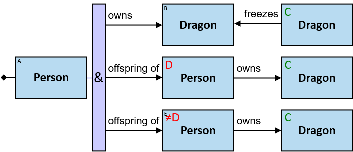

Without the nonidenticality constraint, the same parent could be assigned to both D and E.

Nonidenticality constraints are depicted in red ('≠X'), where X is another entity-tag. Several nonidenticality constraints may be defined for the same pattern-entity, e.g., '≠A,≠C' (see Q57).

_**Q6:** Any person A whose dragon was frozen by two dragons - one owned by one of A's parents, the other owned by another parent (none, one, or both dragons may be owned by both parents)_

_**Q7:** Any person A whose dragon was either (i) frozen by a dragon owned by two of A's parents or (ii) frozen by two dragons - one owned by one of A's parents and the other owned by A's other parent_

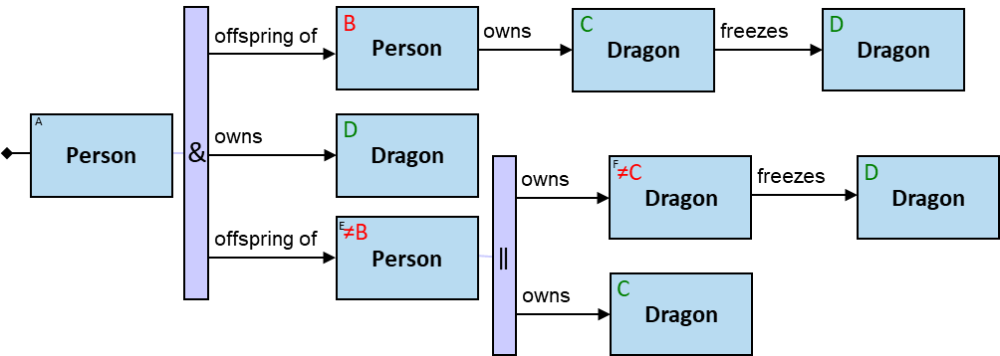

_**Q24:** Any person A having (at least) two parents and owns a dragon that was frozen by a dragon neither of A's parents owns_

Q24 demonstrates the usage of both identicality constraints and nonidenticality constraints for the same pattern-entity.

Consider Q5v1, Q6, Q7, and Q24. For any given assignment, there is another assignment where the two parents are switched (for example, in Q5v1, the assignments to D and E are switched). Such redundant assignments are usually undesired. Using _order constraints_, we can avoid such redundancies (See Q5v2).

Also, consider the following pattern: _Any three persons A, B, and C, who are pairwise friends_. If persons (A1, B1, C1) compose an assignment, so do (A1, C1, B1), (B1, A1, C1), and all other permutations. Such a factorial increase in the number of assignments is usually undesired. Using _order constraints_, we can express patterns such as _Any three persons A<B<C, who are pairwise friends_.

***Order constraints*** can be used when graph-entities should be orderly assigned to either typed entities of the same type or untyped entities.

_**Q31:** Any pair of dragons (A, B) where A froze B, A fired at B, B froze A, and B fired at A_ (version 1)

Without the order constraint, any reported pair of dragons would be reported twice: (D1, D2), (D2, D1).

Property graph data models usually require that each entity and each relationship would be *uniquely identifiable*. To support order constraints, V1 further requires that graph-entities would also be _ordered_. 

Order constraints are depicted in red ('<X' or '≤X'), where X is another entity-tag. Several nonidenticality or order constraints may be defined for the same pattern-entity, e.g., '<A,<B', '≠A,<C' (see Q83).

See also Q49, Q88, Q115v1, Q272, Q337, Q342, Q347, and Q350.

If, for some assignment, an identicality, nonidenticality, or order constraint is not relevant (e.g., identicality constraint between a pair of entities in two branches of a _Some_ quantifier, where the assignment includes only one branch) - the constraint is ignored. Otherwise - the assignment is valid only if the constraint is satisfied.

## Negator

Sometimes we need to express a pattern that contains elements for which there is no assignment. For example, _any person whose first name is Brandon and who does not own a white horse_. Such patterns are composed of:

* A 'positive' component - _any person whose first name is Brandon_
* A negator - _does not_
* One or more 'negative' component - _own a white horse_

An assignment matches the pattern only if:

* It matches a pattern composed only of the positive component: there is an assignment to _a person whose first name is Brandon_.
* The assignment has no superset that matches a pattern composed of the positive component and the negative components: _the person whose first name is Brandon does not own a white horse_.

Such patterns can be composed using _negators_. The pattern starts with the 'positive' component, and negators separate it from the 'negative' components.

A negator is depicted with a **pink 'X' rectangle**. It has one connection on its left side and one connection on its right side. On its left, there is an entity or a quantifier. On its right side - a relationship or a path. A negator may not appear directly left of a relationship or a path with an aggregator (see [Aggregators](#aggregators)).

Query results do not include assignments to entities/relationships/paths right of a negator. Any pattern elements right of a negator is depicted with a gray 'no report' icon on its top-right, indicating  that the query result does not include an assignment for it (see [Latent pattern-entities](#latent-pattern-entities)).

_**Q12:** Any person who does not own a horse_

_**Q13:** Any horse not owned by a person_

_**Q14:** Sweetfoot - if no person owns it_

_**Q15:** Brandon Stark - if he does not own a horse_

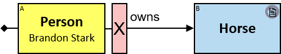

_**Q16:** Any person who does not own Sweetfoot_

_**Q17:** Any horse not owned by Brandon Stark_

_**Q18:** Brandon Stark - if he does not own Sweetfoot_

_**Q19:** Sweetfoot - if Brandon Stark does not own it_

_**Q256:** Any person who does not own a white horse_

_**Q257:** Any person who did not become a horse owner in or after 1011_

_**Q258:** Any person who did not become a white horse owner in or after 1011_

_**Q22:** Any horse not owned by a person who owns a dragon_

The positive component is _a horse_, while the negative component is _owned by a person who owns a dragon_. The right component is anything that follows the negator - up to the end of the branch.

Valid assignments:

* Any horse that is not owned
* Any horse that none of its owners is a person (e.g., a horse owned by a guild)
* Any horse that each person who owns it - does not own a dragon

_**Q333:** Any person who does not own a dragon that both fired at and froze the same dragon_

A negator may also appear left of a relationship that directly follows a quantifier's branch:

_**Q25:** Any dragon (C) not fired at by Balerion but fired at by a dragon that Balerion fired at_ (two versions)

_**Q26:** Any person who is a member of at least one guild that Brandon Stark is a member of, and at least one guild that Brandon Stark is not a member of_ (four versions)

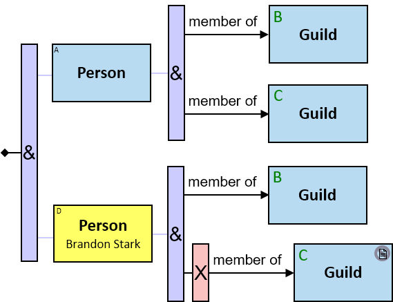

Negators may appear in more than one branch:

_**Q20:** Any horse that is neither owned by Rogar Bolton nor by Robin Arryn_ (two versions)

Note that there are two negative components. This query can also be represented using the _None_ quantifier:

_**Q21:** Any horse not owned by both Rogar Bolton and Robin Arryn_

If either Rogar Bolton or Robin Arryn owns the horse - the owner will not be part of the reported assignments. 

_**Q362:** Any horse owned either by Rogar Bolton or Robin Arryn but not by both_

If either Rogar Bolton or Robin Arryn owns the horse - the owner will be part of the reported assignments.

_**Q335:** Any person and that person's parent for whom there is no horse that both are its owners_

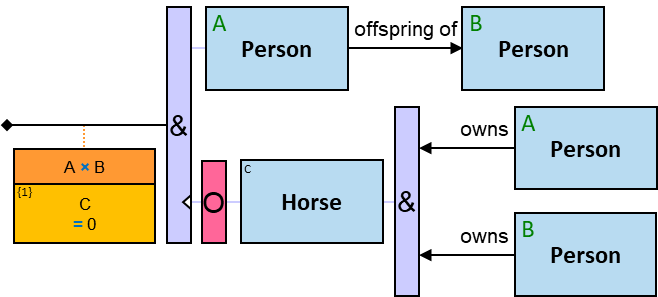

The two negative components refer to the same graph entity.

A sequence of negators:

_**Q23:** Any horse not owned by a person who does not own a dragon_

The positive component is _a horse_, while the negative component is _owned by a person who does not own a dragon_. The right component is anything that follows the left negator - up to the end of the branch.

Valid assignments:

* Any horse that is not owned
* Any horse that none of its owners is a person (e.g., a horse owned by a guild)
* Any horse that each person who owns it - also owns a dragon

## Relationship/Path-Negator

The pattern _Any person whose first name is Brandon and who does not own a white horse_ has assignments in two cases:

* _There is a person whose first name is Brandon_, and _there are no white horses_
* _There is a person whose first name is Brandon_, _there is at least one white horse_, but _there is no person whose first name is Brandon who owns a white horse_

Sometimes we want an assignment to match the pattern only in the second case - we want only assignments that match the whole pattern except given relationships/paths. Hence, an assignment matches the pattern _only if_:

* It matches a pattern composed of the left component and the right component without the relationship/path
  * _There is a person whose first name is Brandon_
  * _There is a white horse_
* The assignment has no superset that matches a pattern composed of the left component, the right components, and the relationship/path
  * _There is no person whose first name is Brandon who owns a white horse_

A _relationship/path-negator_ is depicted with a **red '✕'** mark at the center of the relationship/path arrow/line. The arrow/line and the associated text are faded.

Components located right of a relationship/path-negator are required to have assignments. These assignments are included in the reported assignments.

_**Q357:** Any dragon for which there is at least one dragon (besides itself) it did not freeze_

_**Q83:** Any dragon for which there are at least two dragons (besides itself) it did not freeze_

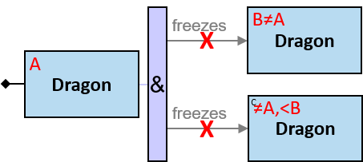

_**Q204:** Any dragon for which there is a dragon not owned by a Sarnorian that did not freeze it_

_**Q205:** Any dragon A and Sarnorian subject C for which there is a dragon not owned by C that did not freeze A_

Relationship/path-negators are often used with aggregators (see Q126, Q63-Q66, Q165, Q298, Q345).

A relationship/path with a relationship/path-negator may be wrapped with a negator.

_**Q82:** Any dragon that froze all other dragons. **Alternative phrasing:** Any dragon for which there is no dragon (besides itself) it did not freeze_ (version 1)

## Combiner

A **vertical purple rectangle with a closing curly brace** represents a _combiner_. A combiner combines two or more consecutive branches of the same quantifier. 

On the combiner's left side are relationships and paths, and on its right side - an entity. A sequence of combiners is valid as well. The entity-type on a combiner's right side must match all the relationship-types and paths on its left side.

_**Q30:** Any pair of dragons (A, B) where A both froze B and fired at B_ (two versions)

A combiner has the same semantics as the duplication of anything right of it to each branch.

_**Q360:** Any dragon that (froze or fired at) all other dragons. **Alternative phrasing:** Any dragon for which there is no dragon (besides itself) it did not (freeze or fire at)_ (version 1)

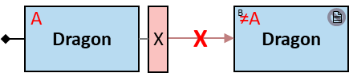

_**Q187:** Any dragon Balerion froze at least once on or after January 1, 1010, **and** at least once for less than ten minutes_

Note that the same graph-relationship may be assigned to both _freezes_ pattern-relationships. Compare with Q185.

_**Q189:** Any dragon Balerion froze at least once on or after January 1, 1010, **or** at least once for less than ten minutes_

_**Q29:** Any dragon that froze or fired at some dragon_ (versions 1-3)

Note that the implied identicality is redundant.

See also note under Q121v1 - combiner right of an A1 aggregator.

_**Q31:** Any pair of dragons (A, B) where A froze B, A fired at B, B froze A, and B fired at A_ (version 2)

Without the order constraint, any reported pair of dragons would be reported twice: (D1, D2), (D2, D1).

_**Q32:** Any pair of dragons (A, B) where A fired at both B and some dragon that fired at B_

_**Q5:** Any person A whose dragon was frozen by a dragon owned by two of A's parents_ (version 2)

_**Q170:** Any three dragons (A, B, D) where A fired at B, A fired at some dragon that fired at B, B froze D, and B froze some dragon that froze D_

_**Q33:** Any dragon A that froze some dragon B, froze some dragon that froze B, and fired at some dragon_

Different branches may be combined with different combiners.

_**Q34:** Any dragon A that froze some dragon B, froze some dragon that froze B, fired at some dragon D, and fired at some dragon that fired at D (B and D may be the same dragon or different dragons)_

_**Q35:** Any pair of dragons (A, B) where A froze B but did not fire at B_

_**Q334:** Any dragon A for which there is no dragon B that A both froze and fired at_

## Chains, Horizontal Quantifiers, and Horizontal Combiner

Relationship's expressions can be _chained_. When chained, each expression with a constraint is a _filtering stage_. An assignment is valid only if all the chained constraints are satisfied, or in other words - if it passes all filtering stages.

_**Q188:** Any dragon Balerion froze at least once - on or after January 1, 1010, for less than ten minutes_

_**Q10:** Any person whose first name is Brandon, who owns some dragon B which froze a dragon C that (i) belongs to an offspring of Rogar Bolton, and (ii) froze a dragon that belongs either to Robin Arryn or to Arrec Durrandon. B froze C at least once in or after 1010 - for longer than 100 seconds_

A **horizontal purple rectangle** represents a _horizontal quantifier_. It contains a quantifier type.

Eleven horizontal quantifier types are defined (as for vertical quantifiers, except the _All_ quantifier). Their semantics are similar to those of vertical quantifiers. _All_ can be implemented by chaining relationship's expressions or by using vertical quantifiers (see Q100).

A horizontal quantifier may appear

* below a relationship
* below a relationship's expression
* below a horizontal quantifier (in a branch)

On its bottom, there zero or more branches. Each branch starts with either

* a relationship's expression, or
* a horizontal quantifier

A branch composed of relationship's expressions with no constraints does not affect the quantifier's evaluation.

A horizontal combiner may be used to combine two or more consecutive branches of the same horizontal quantifier. Each branch ends with either

* A relationship's expressions, or
* A horizontal combiner

Below a horizontal combiner

* Another chained stage that starts with
  * a relationship's expression,
  * a horizontal quantifier, or
  * an aggregator

or

* Another horizontal combiner

_**Q300:** Any pair of dragons (A, B) where A froze B, and at least two of the following conditions are satisfied: (i) the freeze duration was longer than ten minutes (ii) the freeze started after January 1, 980 (iii) the freeze ended before February 1, 980_

_**Q301:** Any pair of dragons (A, B) where A froze B for more than ten minutes, and either the freeze started after January 1, 980, or the freeze ended before February 1, 980_ (two versions)

See also Q267v3.

## Latent Pattern-Entities

Pattern entities may be annotated as implicit latent or explicit latent.

Assignments to _latent pattern-entities_ and assignments to pattern-relationships and pattern-paths connected to latent pattern-entities are not included when pattern assignment is reported.

_Implicit latent pattern-entities_ are pattern-entities that appear
- right of a negator (see Q12, Q22, Q288)
- right of a _None_ quantifier, except branches (or subbranch of a sequence of quantifiers that follows the _None_ quantifier) that starts with an 'O' (see Q359)

Such typed and untyped entities are required to have no assignments; hence, trivially, no assignments would be reported. Such concrete entities would not be reported as well (see Q20).

Implicit latent pattern-entities are depicted with a **gray 'no report' icon** on their top-right. These icons are automatically added by the interactive pattern builder/visualizer tool and may not be added/removed by the pattern composer.

An entity right of a combiner is depicted as implicit latent if it is implicit latent according to each of the combined branches (see Q334). If it is not implicit latent according to one or more branches - it will not be depicted as implicit latent (see Q35).

_Explicit latent pattern-entities_ are non-implicit latent pattern-entities, which the pattern composer marks as latent. Though they may have assignments - those assignments are required not to be reported. Any non-implicit latent pattern-entity may be set as explicit latent.

Explicit latent pattern-entities are depicted with a **red 'no report' icon** on their top-right.

_**Q142:** Any person who owns a white or a black horse and has a parent who owns a dragon. The parent and its dragon are not to be included in the reported assignment_

Suppose person A1 has two parents, each with four _owns_ relationships to dragons. Without the latent annotations, there would be eight pattern assignments per person and _owns_ relationship to a horse. With the latent annotations, there would be only one assignment per person and _owns_ relationship to a horse.

_**Q143:** Any person who owns a horse that is neither white nor black and has a parent that does not own a horse. The parent is not to be included in the reported assignment_

When there are several pattern-entities with the same entity-tag - some may be latent (implicit or explicit) while others are not. See Q337, Q339.

Concrete, typed, and untyped entities may all be latent - implicit or explicit.

At least one pattern-entity should be non-latent.

## Optional Components

An _optional_ is depicted with a **magenta 'O' rectangle**. Anything right of it is optional: if it has a valid assignment - it will be reported (unless it is latent). Otherwise - it will not.

An 'O' may be located directly left of

- a relationship or a path, with or without a relationship/path-negator
- a quantifier, excluding quantifier at the start of the pattern

_**Q147:** Any person A. If A owns both a horse and a dragon - they should be included in the assignment_

_**Q149:** Any person A. If A owns a horse - it should be included in the assignment. If A owns a dragon - it should be included in the assignment as well_

_**Q81:** Balerion. If there is a dragon it did not freeze - it should be included in the assignment_

Quantifier's branches that start with an 'O' do not affect the quantifier's evaluation.

_**Q144:** Any person A who owns a white horse. If A has a parent who owns a horse - the parent and its horse should be included in the assignment_

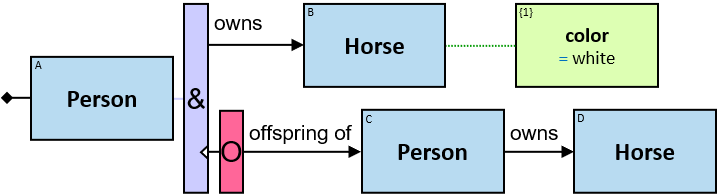

_**Q145:** Any person A who owns a white horse. If A has a parent that does not own a horse - the parent should be included in the assignment_

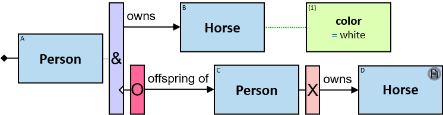

_**Q146:** Any person A who owns a white horse. If A has a parent - the parent should be included in the assignment. If A's parent owns a horse - this horse should be included in the assignment as well_

_**Q148:** Any person A who owns both a horse and a dragon. If A has a parent - the parent should be included in the assignment_

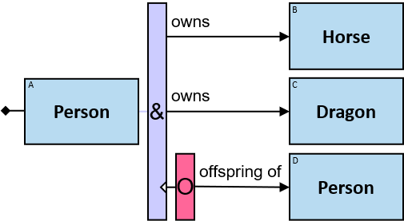

_**Q150:** Any person A who owns a horse or a dragon. If A has a parent - the parent should be included in the assignment_

_**Q203:** Any person A. If A owns both a horse and a dragon - they should be included in the assignment. If A owns both a horse and a dragon and also has a parent - the parent should be included in the assignment as well_

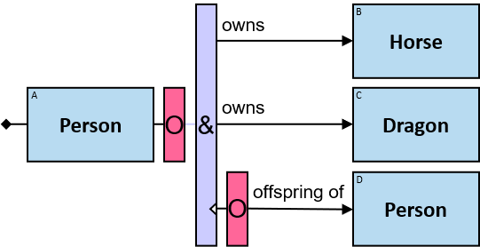

When tags right of an 'O' have no assignments:

- An expression-tag defined right of an 'O' is evaluated to _null_ (see Q140, Q141)
- An A1/A2 aggregation-tag defined right of an 'O' is evaluated to zero (see Q125, Q347)
- An A3 aggregation-tag defined right of an 'O' is 
  - evaluated to _null_ when _aggop_ is _min_/_max_/_avg_/_sum_ (see Q317, Q318)
  - evaluated to zero when _aggop_ is _distinct_
  - evaluated to {} / [] when _aggop_ is _set_/_bag_/_union_/_intersection_
- The number of assignments to an entity-tag / Cartesian product of entity-tags defined right of an 'O' is zero (see Q295, Q320, Q321)
- The number of assignments to an entity type-tag defined right of an 'O' is zero
- The number of assignments to a relationship type-tag defined right of an 'O' is zero

_**Q359:** Any dragon A where (i) there is no black dragon A froze (ii) there is no white dragon A did not freeze, (iii) there is at least one gold dragon A froze, and (iv) there is at least one silver dragon A did not freeze. Also report any red dragon that A froze and any blue dragon that A did not freeze_

Assignments to optional branches are reported regardless of the quantifier type, but only when there is an assignment to the pattern.

## Untyped Entities

A relationship-type may hold between different pairs of entity-types (e.g., owns: {(_Person_, _Dragon_), (_Guild_, _Dragon_), (_Null_, _Dragon_)}). _Untyped entities_ can be used to express patterns such as _Any dragon and its owners_, where the owner can be either a person, a guild, or _Null_.
 
 **A red rectangle** represents an _untyped entity_. Graph-entities of different types may be assigned to an untyped entity.
 
 An **empty red rectangle** represents an entity with no explicit entity-type constraint.

_**Q36:** Any person who owns something_

B assignments are _implicitly type-constrained_ to things that a person can own.

_Implicit entity-type constraints_ are inferred from the pattern, including from identicality, nonidenticality and order constraints.

_**Q49:** Any three dragons with a cyclic freeze pattern and their owners (if any)_

The entity-types of all owners are implicitly constrained to things that can own a dragon.

Entities are implicitly type-constrained also when untyped entities are on either side of a negator or a relationship-negator:

_**Q39:** Any entity of a type that can own a dragon but does not_

_**Q40:** Any dragon that is not owned_

_**Q41:** Any entity of a type that can be owned but is not owned_

_**Q42:** Any entity of a type that can own something but owns nothing_

In addition to the implicit entity-type constraints, *explicit entity-type constraints* can be enforced using:

* a type equality constraint ('= ⟨ _ett_ ⟩') (see Q50),
* a type inequality constraint ('≠ _entity-type_' (see Q43) or '≠ ⟨ _ett_ ⟩' (see Q51))
* a set of at least two allowed entity-types and/or type-tags ('∈ {...}') (see Q37), or
* a set of at least two disallowed entity-types and/or type-tags ('∉ {...}') (see Q52)

_**Q43:** Any dragon that all of its owners (if any) are people_

_**Q37:** Any person who owns a horse or a dragon_

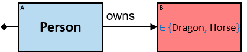

_**Q38:** Any person who owns something which is neither a horse nor a dragon_

For each untyped entity, implicit and explicit type constraints must not nullify the list of valid entity-types. Explicit type constraints must not contradict implicit type constraints. This can be asserted during query analysis.

Since both _horse_ and _dragon_ entity-types have a _name_ property of the same data type (string) - the following pattern is valid:

_**Q291:** Any person who owns a horse or a dragon whose name starts with an 'M'_

## Entity Type-Tags

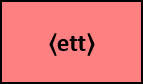

A red rectangle (denoting an untyped entity) may contain an *entity type-tag*, depicted by a **numeric index wrapped in angle brackets**. An entity type-tag represents the entity-type of the entity in a given assignment.

Entity type-tags may be referenced:

* in a type constraint of an untyped entity (see Q50, Q52)
* in an extended aggregator _per_ clause (see Q218v2, Q350)
* in an A3 aggregator "aggop ..." clause (see Q167v2)
* in an extended M1/M2/M3 aggregator "[all but] _k_ ..." clause (see Q209, Q210)

_**Q50:** Any person who owns (at least) two things of the same type_

_**Q51:** Any person who owns (at least) two things of different types_

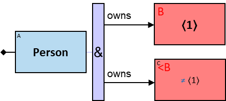

_**Q52:** Any person who owns (at least) two things of different types, neither is a horse_

_**Q167:** Any person whose owned entities are all of the same type_ (version 1)

For any quantifier except _all_ - an entity type-tag defined in a branch can only be referenced in that branch.

An entity type-tag defined right of a negator can only be referenced right of that negator.

An entity type-tag defined right of an 'O' can only be referenced right of that 'O', except when referenced in a _distinct_ ⟨ _ett_ ⟩ A3 aggregator (see Q167v2).

## Untyped Relationships

Multiple relationship-types may hold between a pair of entity-types (e.g., _freezes_: {(Dragon, Dragon)}, _fires at_: {(Dragon, Dragon)}. Untyped relationships can be used to express patterns such as _Any pair of dragons with at least one relationship_, where the relationship-type can be either _freezes_ or _fires at_.

A red arrow/line with no type label or with type constraints represents an _untyped relationship_. Graph-relationships of different types may be assigned to an untyped relationship.

A red arrow/line with no label represents a relationship with no explicit type constraints:

_**Q29:** Any dragon that froze or fired at some dragon_ (version 4)

The relationship is implicitly type-constrained to directional relationship-types between two dragons.

_**Q53:** Any person with a path of length up to three to Rogar Bolton_ (version 1)

Relationships are implicitly type-constrained also when a negator or a relationship-negator wraps an untyped relationship:

_**Q360:** Any dragon that (froze or fired at) all other dragons. **Alternative phrasing:** Any dragon for which there is no dragon (besides itself) it did not (freeze or fire at)_ (version 4)

In addition to the implicit relationship-type constraints, _explicit relationship-type constraints_ can be enforced using:

* a type equality constraint ('= ⟪ _rtt_ ⟫') (see Q367),
* a type inequality constraint ('≠ _relationship-type_' (see Q364) or '≠ ⟪ _rtt_ ⟫' (see Q365))
* a set of at least two allowed relationship-types and/or type-tags ('∈ {...}') (see Q121v2), or
* a set of at least two disallowed relationship-types and/or type-tags ('∉ {...}') (see Q368)

_**Q364:** Any person and an entity that have a relationship of a type other than 'friend of'_

_Implicit relationship-type constraints_ are inferred from the pattern (including from relationships directionality and from entities identicality/nonidenticality/order constraints).

For each untyped relationship, implicit and explicit type constraints must not nullify the list of valid relationship-types. Explicit type constraints must not contradict implicit type constraints. This can be asserted during query analysis.

## Relationship Type-Tags

Instead of a relationship-type, a relationship label may denote a _relationship type-tag_, depicted by a **numeric index wrapped in double angle brackets**. A relationship type-tag represents the relationship-type of the relationship in a given assignment.

Relationship type-tags may be referenced:

* in a type constraint of an untyped relationship (see Q365)
* in an extended aggregator _per_ clause (see Q369)
* in an A3 aggregator "aggop ..." clause (see Q366v2)
* in an extended M1/M2/M3 aggregator "[all but] _k_ ..." clause (see Q369)

_**Q365:** Any pair of dragons that have relationships of at least two types_

_**Q366:** Any pair of dragons that have relationships of at least three types_ (version 1)

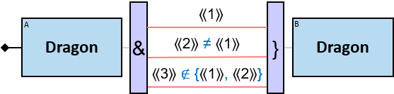

Since there are only two relationship-types between a pair of dragons (_freezes_, _fires at_), this pattern would never have assignments. This can be detected during query analysis.

_**Q367:** Any pair of dragons that have a directional relationship of the same type in both directions_

_**Q368:** Any pair of dragons that have relationships of at least two types, neither is 'freezes'_

Again, the fact that this pattern would never have assignments can be detected during query analysis.

For any quantifier except _all_ - a relationship type-tag defined in a branch can only be referenced in that branch.

A relationship type-tag defined right of a negator can only be referenced right of that negator.

A relationship type-tag defined right of an 'O' can only be referenced right of that 'O', except when referenced in a distinct ⟪ _rtt_ ⟫ A3 aggregator.

## Null Entities

As described above, graph-entities of type _Null_ realize action-types and relationships to unknown/unimportant entities.

Since each graph-entity of type _Null_ is connected by exactly one relationship, there are additional implicit constraints on each typed entity of type _Null_ and on each untyped entity that explicitly allows type _Null_:
* There is no relationship/path on its right (it is a terminal node), or there is no relationship/path on its left (it starts the pattern)
* It is not directly right of a combiner nor directly left of a quantifier
* It is not being aggregated
* Its single connection is either a relationship of a type that supports _Null_ entities on this side or a path that may end with such a relationship
* Its entity-tag is not reused (no identicality, nonidenticality, nor order constraints)

As part of a pattern:
* Concrete entities may not be of type _Null_
* Typed entities may be of type _Null_ if there are no implicit type constraints that disallow it
* For untyped entities, type _Null_ may be explicitly allowed or disallowed only when there are no implicit type constraints that disallow it

As part of an assignment:
* For an untyped entity - graph entities of type _Null_ are valid assignments only if
  * There are no implicit type constraints that disallow it, and
  * There are no explicit type constraints that disallow it, or there are explicit type constraints that allow it

See G1-G20.

## Paths

A _graph-path_ is a sequence of graph-entities and graph-relationships that starts with a graph-entity and ends with a graph entity. A _simple graph-path_ is a graph-path where all entities are pairwise distinct, except, possibly, the first and last.

Each graph-path has a length. The _path length_ is equal to the number of graph-relationships along the path; hence, a relationship is a path of length 1.

A _pattern-path_ connects two pattern-entities - like a pattern-relationship. However, while a pattern-relationships are assigned with graph-relationships, pattern-paths are assigned with simple graph-paths minus the first and last entities, which are not considered a part of the assignment. Thus, pattern-paths are assigned with at least one graph-relationship.

A **blue line** between two pattern-entities represents a pattern-path. Above the line is a _constraint on the path length_. An upper bound on the path length must be defined, hence the constraint must be defined using one of the following constraint types: = _expr_, < _expr_, ≤ _expr_, in _set-expr_, in _bag-expr_, in _list-expr_ or in _interval-expr_, where all expressions or interval bounds evaluate to positive integers.

_**Q53:** Any person with a path of length up to three to Rogar Bolton_ (version 2)

_**Q84:** Any dragon with no paths of length up to three to other dragons_

_**Q55:** Any entity with paths of length up to three to Rogar Bolton, Robin Arryn, and Arrec Durrandon_

Constraints may be defined for both the entities and the relationships along the path:

_Constraints on relationships along the path_ are listed in blue curly brackets above the path's line. The brackets may list either:

- Allowed relationship-types - e.g., {fires at, freezes}. Any unlisted relationship-type is disallowed.
- Constraints on the number of relationships of given types, with optionally - a given direction - e.g., {freezes < 2, fires at = 2}, {freezes = 0}, {→ freezes = 2, ← freezes = 1}. Any unlisted relationship-type / direction is allowed.

_Constraints on entities along the path_ are listed in blue curly brackets below the path's line. The brackets may list either:

- Allowed entity-types - e.g., {Dragon}, {Dragon, Horse}. Any unlisted entity-type is disallowed.
- Constraint on the number of entities of given types - e.g., {Dragon = 0}, {Dragon ≥ 1, Horse ≥ 1}. Any unlisted entity-type is allowed.

A path cannot be composed of _Null_ entities since they are terminal nodes. Therefore, the list of allowed entity-types may not contain _Null_. Similarly, the list of disallowed entity-types may not contain _Null_ as it is implicitly disallowed.

_**Q44:** Any path of length up to four between Vhagar and Balerion, which is composed only of 'freezes' relationships_

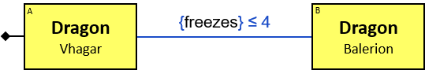

_**Q45:** Any path of length up to four between Vhagar and Balerion composed only of 'freezes' and 'fired at' relationships_

_**Q46:** Any path of length up to four between a dragon owned by Rogar Bolton to a dragon owned by Robin Arryn, which is composed of up to two 'freezes' relationships and only of 'Dragon' entities_

_**Q54:** Any person with paths of length up to three to Rogar Bolton, Robin Arryn, and Arrec Durrandon. The paths composed only of 'friend of' relationships_

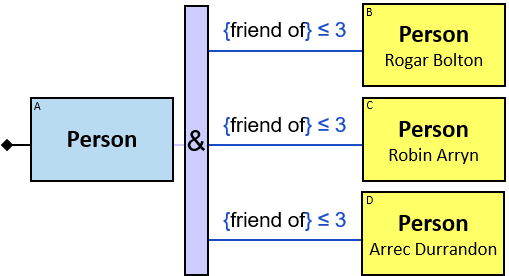

## Shortest Paths

Instead, or in addition to specifying a constraint on the path length - a _shortest path constraint_ can limit paths-assignments to the shortest ones that subject to the constraints on the entities/relationships along the path. If, for example, the length of the shortest path that subjects to the constraints is three - only paths of length three are valid assignments.

_**Q47:** All shortest paths between Vhagar and Balerion_

_**Q48:** All shortest paths between Vhagar and Balerion, which are neither composed of 'freezes' relationships nor 'Dragon' entities_ (version 1)

_shortest_ may not appear directly right of a negator or a path-negator.

## Path Patterns

An alternative to constraints on the entity-types and the relationship-types along a path are constraints on the subgraphs which assignments to a path are composed of. 

A _path pattern_ is a pattern that has one entity marked as _left-terminal_ and one entity, possibly the same one, marked as _right-terminal_.

A _path-assignment_ is composed of chained subgraphs; each subgraph is assigned to a path pattern. There is an overlap between assignments to successive path patterns:

- The graph-entity assigned to the left-terminal of the first path pattern of a path is also assigned to the entity preceding the path
- The graph-entity assigned to a right-terminal of a path pattern is also assigned to the left-terminal of the successive path pattern
- The graph-entity assigned to the right-terminal of the last path pattern of a path is also assigned to the entity following the path

A **blue table** below the path defines constraints on the path's path pattern types. The table has two columns:

- A constraint on the number of allowed path pattern instances of this type along the path. The following constraint types can be used: n, <n, ≤n, >n, ≥n, n₁..n₂, where the values are positive integer constants.
- A path pattern

The last row defines whether a path-assignment may be composed of other graph-elements ('✔' if yes, '✘' if no).

_**Q48:** All shortest paths between Vhagar and Balerion, which are neither composed of 'freezes' relationships nor 'Dragon' entities_ (version 2)

_**Q58:** Any Sarnorian who has a path of length up to six to an Omberian. The path passes through Rogar Bolton_

_**Q56:** constraints on path patterns_

In this example, path assignments must be composed of assignments to four path patterns

_**Q57:** constraints on path patterns_

* Path assignments must not contain people whose first name starts with 'M' (note that assignments to A and C are not considered part of the path assignment)
* There must be between two and three assignments to any of two path patterns
* The path may be composed of additional graph-elements

_**Q322:** Any dragon owned by at least five consecutive generations of the same dynasty_

_**Q323:** Any dragon owned by at least five (not necessarily consecutive) generations of the same dynasty_

See also Q290, Q329.

## Referencing Expression-Tags

Each green rectangle has an _expression-tag_ on its top-left corner, depicted by an index wrapped in curly brackets ('{xt}'). An expression-tag represents the result of the evaluation of an entity's expression, relationship's expression, or Cartesian product's expression - for a given assignment.

Expression-tags and aggregation-tags are jointly called _EA-tags_. Each EA-tag has a unique positive integer index. If an EA-tag is referenced at least once - it is depicted in bold purple. Otherwise - it is depicted in black.

Expression-tags may be referenced:

* in an entity, relationship, or Cartesian product's expression (see Q267v2, Q308, Q349)
* in an entity, relationship, or Cartesian product's expression constraint (see Q108, Q109)
* in a path length constraint
* in an extended aggregator _per_ clause (see Q114v3, Q270)
* in an A3 aggregator "aggop ..." clause (see Q116)
*	in an extended M1/M2/M3 aggregator "[all but] _k_ ..." clause (see Q220, Q262)
* in an M3 aggregator "with min/max ..." clause (see Q130)
* in an A1/A2/A3 aggregator constraint (see Q120, Q255)

_**Q108:** Any person who has the same birth date as Brandon Stark_

{1} is a property of the only assignment to A. {2} is a property of each unique assignment to B.

For any quantifier except _All_ - an EA-tag defined in a branch that affects the quantifier's evaluation can only be referenced in that branch.

An EA-tag defined in a branch of a horizontal quantifier's branch that affects the quantifier's evaluation can only be referenced in that branch.

For each entity/relationship/Cartesian product - if the same expression is used more than once - the same expression-tag will be assigned (see also Q267v3, Q311):

Self or circular references are invalid:

_**Q111:** Any person A who has no friends with whom A shares a birthdate_

An EA-tag defined right of a negator can only be referenced right of that negator.

_**Q353:** Any person A that in the day A turned two years old - at least one person was born, but there is no such person A became a friend of since A reached 20_

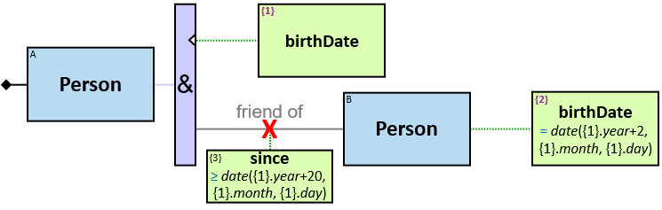

A relationship's expression defined below a relationship-negator can only be referenced in that chain.

Composite properties and subproperties are tagged and can be referenced similar to ordinary properties:

_**Q109:** Any person A whose parent owned a horse or a dragon before A's birth_ (two versions)

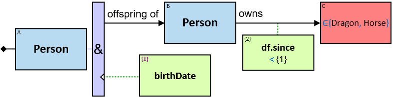

_**Q110:** Any three dragons with cyclic freezes of more than 100 minutes, in chronological order, within six months, and their owners (if any)_

_**Q112:** Any person who owned a horse and a dragon at the same time frames_ (three versions)

The subproperties can be compared one-by-one:

The order of the expressions along a chain does not matter. The following representation is valid, as well:

_**Q266:** Any person A who has the same name (first and last) as A's parent_ (two versions)

_**Q267:** Any person who was a member of two guilds at overlapping timeframes_ (three versions)

The following version also covers some cases where one membership has either a _null_ (_unknown_) start date or a _null_ (_unknown_) end date:

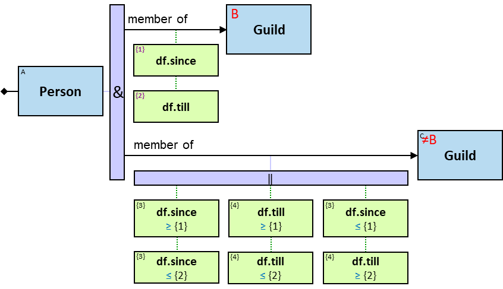

## Aggregators

One can use an order constraint to represent patterns such as _Any person who owns at least two horses_, but it is quite cumbersome for patterns such as _Any person who owns at least 20 horses_. Patterns such as _Any dragon that froze dragons more than ten times_ or _Any dragon that froze dragons for a cumulative duration longer than 100 minutes_ cannot be expressed without aggregators.

**An orange rectangle** represents an aggregator. It is composed of two parts:
- The upper part (dark orange) defines how assignments are split into disjoint sets (_per_ clause)
- The lower part (light orange) defines an aggregate expression that is evaluated per each set and may contain a constraint on the result of the evaluation of the aggregate expression

Here are three examples:

First example: _Any person who owns at least 20 horses_ (Q59)

All assignments to the pattern, ignoring the aggregator, are found and split into sets. In each set, all the assignments to A are identical. Only sets with more than two assignments to B are valid pattern assignments.

Second example: _Any dragon that froze dragons more than ten times_ (Q71)

All assignments to the pattern, ignoring the aggregator, are found and split into sets. In each set, all the assignments to A are identical. Only sets with more than ten assignments to the relationship are valid pattern assignments.

Third example: _Any pair of dragons (A, B) where A froze B for a cumulative duration longer than 100 minutes_ (Q86)

All assignments to the pattern, ignoring the aggregator, are found and split into sets. In each set, all the assignments to both A and B are identical. Only sets where the sum of the duration of all _freezes_ relationships is greater than 100 minutes are valid pattern assignments.

**Evaluating an aggregator:**

- Step 1: All assignments to the pattern excluding this aggregator and without constraints based on this aggregation-tag ('at') are found
  - In the first example: all (person, horse) pairs (A, B) where A owns B
  - In the second and third examples: all dragon pairs (A, B) where A froze B
  
- Step 2: The assignments are split into disjoint sets. In each set - the assignment to the entities listed in the _per_ clause is identical. Each set is to be aggregated separately.
  - In the first and second examples: In each set - all assignments to A are identical
  - In the third example: In each set - all assignments to both A and B are identical
  
- Step 3: Per each set of assignments - _at_ is evaluated
  - In the first example: per person A: _at_ = number of horses A owns
  - In the second example: per dragon A: _at_ = cumulative number of its _freezes_ relationships to all dragons
  - In the third example: per dragon pair (A, B): _at_ = sum of the duration of all _freezes_ relationships from A to B
  
- Step 4: Per each set of assignments: the aggregation constraint (if given) and any other constraint that is based on this aggregation-tag are evaluated
  - In the first example: the aggregation constraint is _at_ ≥ 20
  - In the second example: the aggregation constraint is _at_ > 10
  - In the third example: the aggregation constraint is _at_ > 100 [min]
  
- Step 5: Each set of assignments for which the constraint is satisfied - is a valid assignment to the pattern

Next, we will define three aggregator types: A1, A2, and A3. Steps 1, 2, 4, and 5 are identical for all types. Step 3 is different, as sets are aggregated in different ways.

Let ___S___ denote the set of all assignments to the pattern excluding this aggregator (subject to aggregators evaluation order) (that is step 1 above).

**Upper part**

Let ___T___ denote a Cartesian product of one or more entity-tags.

For all aggregator types (A1, A2, A3, M1, M2, M3, and R1), the _per_ clause has one of the following formats:

- '_et1 × et2 × ..._':

  _T_ = _et1 × et2 × ..._
    
- '←':

  _T_ = entity-tag directly left of the aggregator
    
- '→':

  _T_ = entity-tag directly right of the aggregator not wrapped with a negator nor preceded by a _None_ quantifier (valid only when there is exactly one such entity-tag (A1: see Q246)
    
- '↔':

  _T_ = _et1 × et2_ where _et1_ is directly left of the aggregator, and there is a single entity directly right of the aggregator not wrapped with a negator nor preceded by a _None_ quantifier - _et2_ (A2: see Q75)
  
Wherever possible, the notations '←', '→' and '↔' are used instead of entity-tags.

Next, let ___TA___ denote a of all unique assignments to _T_ in _S_. _TA[n]_ is the n'th unique assignment to _T_.

Let ___S(n)___ denote a subset of _S_: the set of all assignments composed of _TA[n]_ (that is step 2 above).

The upper part is optional. When there is no upper part - _S_ is not split.

**Lower part**

The lower part contains an aggregation-tag, an aggregate expression, and optionally a constraint on the result of the evaluation of the aggregate expression.

The _aggregation-tag_ is on the top-left corner and is depicted by an index wrapped in curly brackets ('{at}'). An aggregation-tag represents the result of the evaluation of the aggregate expression for a given set of assignments.

For each entity/relationship/Cartesian product - if the same expression/aggregation is used more than once - only one EA-tag will be assigned (see Q64, Q73v2, Q82v2).

_at_ is evaluated per each _TA[n]_. In the first example above, {1} is evaluated per each unique assignment to A in _S_. _at_ is a _calculated property_ of _TA[n]_. When there is no upper part - _at_ is a global property (see {1} in Q82v3, {1} in Q372, {2} in Q356).

Aggregation-tags may be referenced:

* in an entity, relationship, or Cartesian product's expression (see Q315, Q317)
* in an entity, relationship, or Cartesian product's expression constraint (see Q337, Q338v2)
* in a path length constraint
* in an extended aggregator _per_ clause (see Q211)
* in an A3 aggregator "[all but] _k_ ..." clause (see Q129)
* in an M3 aggregator "with min/max ..." clause (see Q91)
* in an extended M1/M2/M3 aggregator "[all but] _k_ ..." clause (see Q212)
* in an A1/A2/A3 aggregator constraint (see Q125, Q127, Q332v2)

## A1 Aggregator

  
Let ___B___ denote a list of Cartesian products of entity-tags. _B_ must be nonempty and must not be composed of entity-tags composing _T_.

The lower part of an A1 aggregator contains the following elements:

- One of the following:

  - '_et11 × et12 × ..._ ∪ _et21 × et22 × ..._ ∪ _..._' (all products have the same arity):
  
    _B_ = [_et11 × et12 × ..._ , _et21 × et22 × ..._ , _..._] ('∪' - see Q295)
    
  - '←':
  
    card(_B_) = 1; _B[1]_ = [_et_] where _et_ is directly left of the aggregator (see Q249, Q250)
    
  - '→':
  
    _B_ = [_et1, et2, ..._] where _et1, et2, ..._ are directly right of the aggregator and not wrapped with a negator nor preceded by a _None_ quantifier (equivalent to '_et1_ ∪ _et2_ ∪ _..._') (see Q294, Q175, Q176 where card(B)>1)
    
  - '↔':
  
    _B_ = [_et × et1, et × et2, ..._] where _et_ is directly left of the aggregator and _et1, et2, ..._ are directly right of the aggregator and not wrapped with a negator nor preceded by a _None_ quantifier (equivalent to '_et × et1_ ∪ _et × et2_ ∪ ...')
    
  Let ___BA(n, o)___ denote the list of all assignments to _B[o]_ in _S(n)_

- **aggregation-tag**: _at(n)_ = &#124;_BA(n, 1)_ ∪ _BA(n, 2)_ ∪ ..._&#124;
  
  We are using _card(union(all assignments to all elements in B))_ instead of _sum(card(assignment to one element in B))_ since two elements in _B_ may have the same assignment (see Q175), and we are counting _distinct_ assignments to all elements in _B_ per _n_.
  
  When an optional part has no assignments, A1 aggregation-tags defined right of the 'O' are evaluated to zero (see Q125).

- an optional **constraint** on _at(n)_

  **For each _n_: _S(n)_ is reported only if _at(n)_ satisfies the constraint**
  
  Note that a '= 0' constraint cannot be satisfied unless the entities composing B are right of an 'O', as such constraint means that there are no assignments to the pattern excluding this aggregator. Similarly:

  - no constraint is equivalent to '_> 0_' constraint
  - '_≠ expr_', '_< expr_', and '_≤ expr_' constraints are not satisfied when _at(n)_ is zero
  - '_= expr_', '_≥ expr_', and '_∈ [expr1, expr2]_' constraints are not satisfied when _at(n)_ is zero even if _expr_ is evaluated to zero

A1 location:

- Below a relationship/path

  A relationship/path with an A1 below it may have a relationship/path-negator (see Q63-Q66) and may be wrapped with an 'O' (see Q82v2, Q126).
- Below a quantifier-input (excluding quantifier at the start of the pattern)

  See Q305v1, Q121v1, Q122. A quantifier-input with an A1 below it may be wrapped with an 'O'.
  
- Below the pattern's start (even when followed by a quantifier)

  See Q27, Q261, Q332.
 
  
- If all entities in _T ∪ B_ are in a sequence: if all the entities in _T_ appear right of all the entities in _B_: left of the rightmost entity in _T_ (see Q247). Otherwise: right of the leftmost entity in _T_ (see Q243)
- If entities in _T ∪ B_ are in different branches of a quantifier: below the quantifier-input (see Q27)

_**Q59:** Any person who owns at least 20 horses_

{1} is a property of each unique assignment to A in _S_.

_**Q60:** Any dragon that was frozen by exactly five dragons_

If some dragon B froze some dragon A more than once - B would still be counted only once per A. A1 counts _distinct_ entity assignments.

_**Q61:** Any entity that owns more than two entities_

_**Q62:** Any person who has paths of length up to four to more than five people_

_**Q136:** Any dragon A that froze (dragons that froze dragons B). The cumulative number of distinct Bs (per A) is greater than 100_ (two versions)

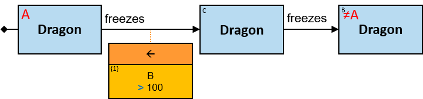

_**Q177:** Any pair of dragons (A, B) were A was frozen by at least ten B's and froze each one of those_ (two versions)

First, any pair (A, B) matching the pattern excluding the aggregator is found. Then, the aggregation constraint is checked:

For each assignment to A, there are at least ten assignments to B such that (B froze A and A froze B)

This second version is for illustrative purposes only:

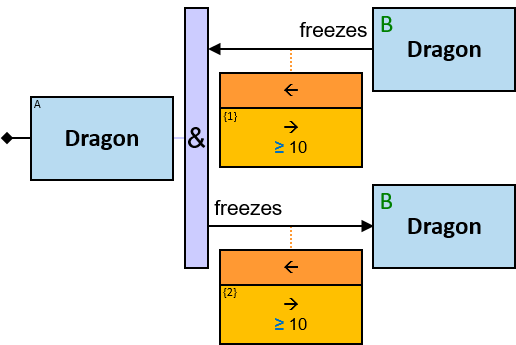

First, any pair matching the pattern excluding the aggregators is found. Then, the aggregations constraints are checked one by one:

For each assignment to A:

* There are at least ten assignments to B such that (B froze A, and A froze B)
* There are at least ten assignments to B such that (A froze B, and B froze A)

_**Q178:** Any dragon A frozen by at least ten dragons and either (i) A froze only one dragon - which is not one of those, or (ii) A froze at least two dragons_

First, any dragon triplet (A, B, C) matching the pattern excluding the aggregator is found. Then, the aggregation constraint is checked:

For each assignment to A, there are at least ten assignments to B such that (B froze A, and A froze a dragon that is not B)

Hence, for each assignment to A, at least ten dragons froze A, and either (i) A froze only one dragon - which is not one of those, or (ii) A froze at least two dragons

_**Q85:** Any dragon that froze at least ten dragons and was frozen by at least ten dragons_ (two versions)

This second version is for illustrative purposes only:

First, any dragon triplet (A, B, C) matching the pattern excluding the aggregators is found. Then, the constraints are checked one by one:

For each assignment to A:

* There are at least ten assignments to B such that A froze B, and a dragon other than B froze A
* There are at least ten assignments to C such that C froze A, and A froze a dragon other than C

Hence, for each assignment to A:

* A froze at least ten dragons, and either (i) only one dragon froze A - which is not one of those, or (ii) at least two dragons froze A
* At least ten dragons froze A, and either (i) A froze only one dragon - which is not one of those, or (ii) A froze at least two dragons

Hence, A froze at least ten dragons, and at least ten dragons froze A

_**Q101:** Any person who owns at least five white horses_

_**Q102:** Any dragon A that was frozen by exactly two dragons, each of which was frozen at least once. A might have been frozen by additional dragons that were never frozen_

_**Q166:** Any **dragon** that more than five Sarnorians own a dragon that froze **it**_

_**Q246:** Any dragon B that froze at least one dragon and was frozen by more than ten dragons_

{1} is a property of each unique assignment to B in _S_.

_**Q247:** Any dragon C that more than ten dragons froze dragons that froze it_

_**Q113:** Any person A who has at least five friends with whom A shares a birthdate_

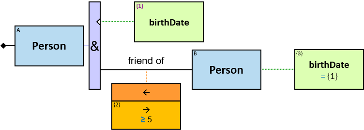

_**Q114:** Any person who owns at least five horses of the same color_ (versions 1, 2)

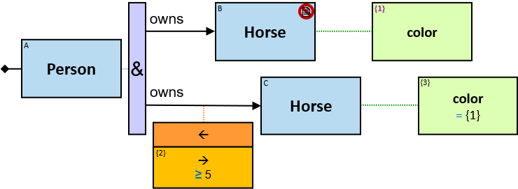

B is explicit latent to avoid redundant results. Were B not latent, each pattern assignment would have one of A's dragons assigned to B and all A's dragons of the same color assigned to C. When B is latent, all such reported results are identical, hence, reported only once.

The following pattern avoids redundant results as well:

_**Q218:** Any person who owns at least five entities of the same type_ (version 1)

_**Q292:** Any person A that at least 80% of A's horses are black_

_**Q63:** Any Masons Guild member who more than fifty Masons Guild members are not friends of_

_**Q65:** Any person A who does not own more than two things that (at least) one of A's parents owns/owned_

_**Q66:** Any person from whom more than five people do not have a path of length up to six_

_**Q151:** Any horse owned by more than ten people, at least one is Sarnorian. Only the Sarnorian owners should be reported_

_**Q152:** Any horse owned by more than ten people. Only the Sarnorian owners should be reported_

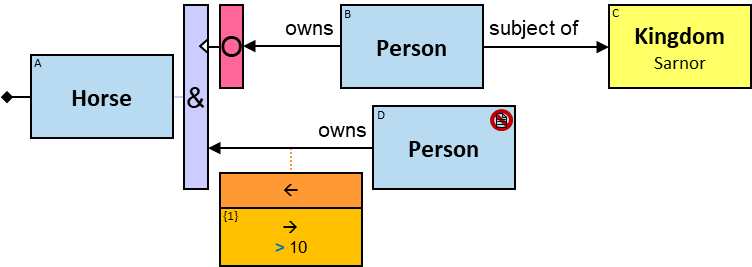

_**Q125:** Any dragon that the number of dragons it froze is greater than the number of dragons that froze it_

{1} is evaluated to zero when the optional part has no valid assignments.

_**Q126:** Any dragon that the number of dragons it froze is greater than the number of dragons it did not freeze_

_**Q249:** Any triplet of sets (people A, dragons B, horses C) where (i) any person in A owns at least one dragon in B and at least one horse in C, (ii) any dragon in B is owned by at least ten people in A, and (iii) any horse in C is owned by at least ten people in A_

_**Q250:** Any triplet of sets (people A, dragons B, horses C) where (i) any person in A owns at least one dragon in B or at least one horse in C, (ii) any dragon in B is owned by at least ten people in A, and (iii) any horse in C is owned by at least ten people in A_

_**Q344:** Any triplet of sets (people A, dragons B, horses C) where (i) any person in A owns at least one dragon in B and at least one horse in C, (ii) any dragon in B is owned by at least ten people in A, and (iii) any horse in C is owned by less than five people in A_

_**Q345:** Any triplet of sets (people A, dragons B, horses C) where (i) any person in A owns at least one dragon in B and does not own at least one horse in C (ii) any dragon in B is owned by at least ten people in A, and (iii) any horse in C is not owned by at least ten people in A_

_**Q82:** Any dragon that froze all other dragons. **Alternative phrasing:** Any dragon for which there is no dragon (besides itself) it did not freeze_ (version 2)

The dragons that were frozen will not be a part of the assignment.

_**Q360:** Any dragon that (froze or fired at) all other dragons. **Alternative phrasing:** Any dragon for which there is no dragon (besides itself) it did not (freeze or fire at)_ (version 2)

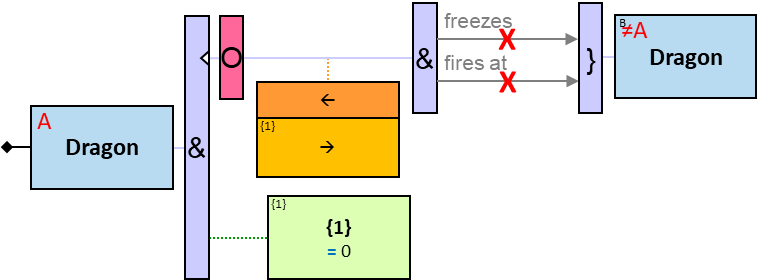

_**Q64:** Any dragon that no more than four dragons owned by Sarnorians did not freeze it_

_**Q165:** Any dragon that no more than four Sarnorians own a dragon that did not freeze it_

_**Q206:** Any dragon A that for each of no more than four Sarnorians C there is a dragon C does not own that did not freeze A_

_**Q305:** Any person A that the number of horses A owns plus the number of dragons A owns - is at least ten_ (two versions)

_**Q121:** Any dragon that froze or fired at at least ten dragons_  (two versions)

'→' is the entity directly right of the combiner.

Note that any dragon that was both frozen and fired at - would be counted only once.

_**Q122:** Any dragon that fired at dragon B and fired at a dragon that fired at B - for at least ten different B's_

_**Q294:** Any dragon that fired at Balerion and at least nine other dragons_

_**Q175:** Any dragon that froze some dragon at least once and fired at some dragon at least once. The number of dragons it froze/fired at – is at least ten_

Note that if a dragon were both froze and fired at - it would be counted only once. A1 counts _distinct_ entity assignments.

_**Q298:** Any dragon A where (i) there is at least one black dragon A froze (ii) there is at least one white dragon A did not freeze, (iii) there is no gold dragon A froze, (iv) there is no silver dragon A did not freeze, and (v) the number of black or red dragons A froze plus the number of white and blue dragons A did not freeze - is at least ten. Report all black and red dragons that A froze and all white and blue dragons that A did not freeze_

Note that the entities that are right of a negator are not aggregated, but the entities that a right of a relationship/path-negator and no negator are aggregated. Compare with Q358.

_**Q176:** Any dragon that either (i) froze at least one dragon and fired at at least one dragon it did not freeze. The number of dragons it froze/fired at is at least ten, or (ii) froze at least ten dragons_

_**Q293:** Any person A that at least 80% of the horses owned by A and/or by (at least) one of A's parents - are jointly owned by A and by (at least) one of A's parents_

_**Q288:** Any person A who owns a dragon that froze more dragons than any dragon owned by any of A's ancestors_

_**Q290:** Any path of length up to ten between Rogar Bolton and Robin Arryn that does not contain hubs (in this pattern - hubs are entities with degree ≥ 1000)_

_**Q329:** Any Sarnorian who has paths of length up to six to more than five Omberians, Each of these paths passes through Rogar Bolton_

_**Q295:** Any person A that the number of dragons A owns plus the number of dragons A does not own that A's dragons fired at - is at least ten_

Note that if any of A's dragons were fired at one of A's other dragons - it would not be counted twice.

_**Q248:** Any pair of dragons (A, C) where A froze more than ten dragons that froze C_

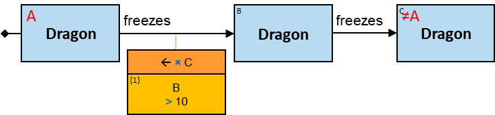

{1} is a property of each unique assignment to A × C in _S_.

_**Q243:** Any pair of people (A, D) where at least five of A's dragons froze one or more D's dragons_

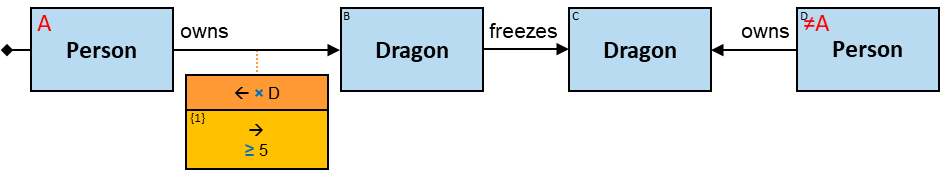

_**Q244:** Any pair of people (A, D) where at least five of A's dragons froze D's dragons, and at least five D's dragons were frozen by one or more A's dragons_

_**Q27:** Any person A where there are less than 500 horses (combined) of the same colors as A's owned horses_

_**Q28:** Any person who owns a horse of a rare color (there are less than 500 horses of that color)_

Patterns Q346, Q352, and Q355, are similar in structure, but the aggregation is different:

_**Q346:** Any dragon that froze at least ten dragons of the colors of horses of its owners_

_**Q352:** Any dragon that froze at least ten dragons of the colors of horses of one of its owners_

_**Q355:** Any dragon that froze at least ten dragons of the color of one horse of one of its owners_

_**Q207:** Any pair of dragons where the difference between the number of dragons that one of them froze and the number of dragons that the other froze is less than 10_

{3} is a property of each unique assignment to A × C in _S_.

_**Q279:** Any pair of people (A, E), each own dragons, where no A's dragon froze any of E's dragons_

_**Q82:** Any dragon that froze all other dragons. **Alternative phrasing:** Any dragon for which there is no dragon (besides itself) it did not freeze_ (version 3)

{1} is a global property.

In contrast to Q82v1 and Q82v2, the frozen dragons will be a part of the assignment.

_**Q360:** Any dragon that (froze or fired at) all other dragons. **Alternative phrasing:** Any dragon for which there is no dragon (besides itself) it did not (freeze or fire at)_ (version 3)

_**Q375:** The difference between the number of white dragons and the number of black dragons_

{2}, {4} and {5} are global properties. {5} is a global expression.

## A2 Aggregator

Let ___R___ denote a list where each element is a pattern-relationship/pattern-path. _R_ must be nonempty.

The lower part of an A2 aggregator contains the following elements:

- '↑' (an arrow pointing to the relationship/path on top of the aggregator):

  When A2 appears below a relationship/path - card(_R_) = 1; _R[1]_ = the relationship/path.

  When A2 appears below a quantifier-input - each element in _R_ is the relationship/path that follows one branch of the quantifier, excluding relationships/paths wrapped with a negator or a relationship/path-negator (see Q123, Q358).

  Let ___RA(n, o)___ denote the list of all assignments to _R[o]_ in _S(n)_. 

- **aggregation-tag**: _at(n) = &#124;RA(n, 1)_ ∪ _RA(n, 2)_ ∪ ... _&#124;_

  We are using _card(union(all assignments to all elements in R))_ instead of _sum(card(assignment to one element in R))_ since two elements in _R_ may have the same assignment (see Q100), and we are counting _distinct_ assignments to all elements in _R_ per _n_.

  When an optional part has no assignments, A2 aggregation-tags defined right of the 'O' are evaluated to zero (see Q347).

- an optional **constraint** on _at(n)_

  **For each _n_: _S(n)_ is reported only if _at(n)_ satisfies the constraint**
  
  Note that a '= 0' constraint cannot be satisfied, as such constraint means that there are no assignments to the pattern excluding this aggregator. Similarly:

  - no constraint is equivalent to '_> 0_' constraint
  - '_≠ expr_', '_< expr_', and '_≤ expr_' constraints are not satisfied when _at(n)_ is zero
  - '_= expr_', '_≥ expr_', and '_∈ [expr1, expr2]_' constraints are not satisfied when _at(n)_ is zero even if _expr_ is evaluated to zero

A2 location:

- Below the relationship/path whose assignments are counted.

  A relationship/path with an A2 below it may be wrapped with an 'O'.
  
- Below the quantifier-input (except a _None_ quantifier) that assignments to relationships/paths on its right are counted (see Q297, Q174).

  A quantifier-input with an A2 below it:
  - may be wrapped with an 'O' (except at the pattern's start)
  - at least one branch of the quantifier (or subbranch of a sequence of quantifiers) must start with a relationship/path with no relationship/path-negator that is not wrapped with a negator, nor preceded by a _None_ quantifier

_**Q72:** Any dragon that was frozen exactly ten times_ (two versions)

_**Q71:** Any dragon that froze dragons more than ten times_

_**Q73:** Any dragon that did not freeze dragons or froze dragons no more than ten times_ (two versions)

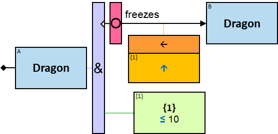

_**Q123:** Any dragon that either froze or fired at dragons - at least ten times_

(Per assignment to A - counting the number of assignments to the relationship directly right of the quantifier)

_**Q104:** Any person who owned white horses at least ten times (same or different horses)_

_**Q296:** Any person who owned horses at least ten times - each horse is either white or weighs more than 100 Kg_ (two versions)

If B and C are assigned with the same graph-entity (a white horse that weighs more than 100 Kg), identical assignments to the two _owns_ relationships would be counted only once. A2 counts _distinct_ relationship/path assignments.

_**Q79:** Any person with more than five paths of length up to four to other people_

_**Q105:** Any dragon A that was frozen exactly two times by dragons, each of which was frozen at least once. A might have been frozen by additional dragons that were never frozen_

_**Q245:** Any dragon B that was frozen at least once and froze dragons exactly twice_

_**Q185:** Any dragon Balerion froze at least once on or after January 1, 1010, at least once for less than ten minutes, and at least twice (on or after January 1, 1010, or for less than ten minutes)_

(counting the number of *distinct* _freezes_ relationships)

_**Q127:** Any dragon that froze dragons owned by Sarnorians more times than dragons owned by Omberians_

_**Q339:** Any dragon Balerion froze more than ten times; report only those freezes that are in or after 1010_

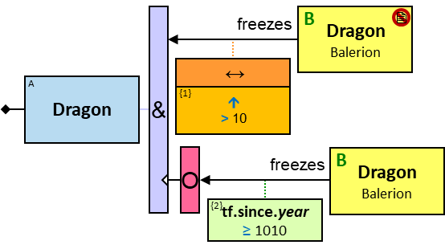

_**Q297:** Any dragon that the number of times it fired at dragons plus the number of paths of length up to three between it and some horse - is at least ten_

_**Q124:** Any dragon that either (froze a dragon) or (fired at a dragon that fired at a dragon) - at least ten times_

_**Q173:** Any dragon that fired at at least two dragons and fired at least ten times_

(counting the number of *distinct* _fired at_ relationships). C is explicit latent to avoid redundant results (any dragon fired at would be assigned at least once to B and at least once to C).

_**Q174:** Any dragon that either (i) froze at least one dragon and fired at at least one dragon it did not freeze, or (ii) froze at least two dragons. If (i): the number of times it froze/fired at dragons is at least ten; otherwise: the number of times it froze dragons is at least ten_

_**Q75:** Any pair of dragons (A, B) where B froze A between eight and ten times_

_**Q76:** Any dragon that froze Balerion between eight and ten times_

_**Q242:** Any pair of people (A, D) where at least five times one of A's dragons froze one of D's dragons_

_**Q358:** Any dragon A where (i) there is at least one black dragon A froze (ii) there is at least one white dragon A did not freeze, (iii) there is no gold dragon A froze, (iv) there is no silver dragon A did not freeze, and (v) the number of times A froze black and red dragons is at least ten. Report all black and red dragons that A froze_

Pattern-relationships that are wrapped with a negator and pattern relationships with a relationship/path-negator are not aggregated. Compare with Q298.

_**Q372:** The number of times dragons were frozen_

{1} is a global property.

## A3 Aggregator

The lower part of an A3 aggregator contains the following elements:

- One of the following:

  - _aggop expr_

    _aggop_ is _min/max/avg/sum_ - for aggregating values of a supported type, _union/intersection_ - for aggregating sets/bags of any type, or _distinct/set/bag_ - for aggregating values of any type. _distinct_ returns the number of distinct _non-null_ evaluation results; _set_ returns a set of all _non-null_ evaluation results (see Q332v2); _bag_ returns a bag of all _non-null_ evaluation results (see Q315).

    _expr_ is an expression composed of constants, properties, and subproperties of _R_ (when A3 appears below a relationship _R_ with no relationship-negator) (see Q86, Q354), EA-tags defined on top of the aggregator (see Q277), and EA-tags defined right of the aggregator (see Q116, Q137, Q169)
  
  - _distinct_ ⟨ _ett_ ⟩

    ⟨ _ett_ ⟩ is an entity type-tag defined right of the aggregator (see Q167v2)
    
  - _distinct_ ⟪ _rtt_ ⟫

    ⟪ _rtt_ ⟫ is a relationship type-tag defined on top of the aggregator or right of the aggregator (see Q366v2)
    

  Let ___BA(n)___ denote the list of the evaluation results of _expr_/⟨ _ett_ ⟩/⟪ _rtt_ ⟫ for all assignments in _S(n)_.
  
- **aggregation-tag**:
  - if _aggop_ is _min/max/avg/sum/distinct/union/intersection_: _at(n) = aggop(BA(n)[1], BA(n)[2], ...)_
  - if _aggop_ is _set_: _at(n) = {BA(n)[1], BA(n)[2], ...}_ (with no duplicate values and no _null_ values)
  - if _aggop_ is _bag_: _at(n) = [BA(n)[1], BA(n)[2], ...]_ (with duplicate values and no _null_ values)

  When an optional part has no assignments, A3 aggregation-tags defined right of the 'O' are evaluated to _null_ when _aggop_ is _min/max/avg/sum_, evaluated to zero when _aggop_ is _distinct_, and evaluated to {} / [] when _aggop_ is _set/bag/union/intersection_.

- an optional **constraint** on _at(n)_

  **For each _n_: _S(n)_ is reported only if _at(n)_ satisfies the constraint**

  When aggop is distinct: a '= 0' constraint cannot be satisfied unless _ett_ / _rtt_ is right of an 'O', as such constraint means that there are no assignments to the pattern excluding this aggregator. Similarly:
  
  - no constraint is equivalent to '_> 0_' constraint
  - '_≠ expr_', '_< expr_', and '_≤ expr_' constraints are not satisfied when _at(n)_ is zero
  - '_= expr_', '_≥ expr_', and '_∈ [expr1, expr2]_' constraints are not satisfied when _at(n)_ is zero even if _expr_ is evaluated to zero

A3 location:

- Below a relationship/path

  When A3 appears below a relationship _R_ and _expr_ is composed of at least one property or subproperty of _R_ - _R_ may be wrapped with an 'O'. Otherwise - a relationship/path with an A3 below it may have a relationship/path-negator and may be wrapped with an 'O'.
  
- Below a quantifier-input (excluding quantifier at the start of the pattern)

  A quantifier-input with an A3 below it may be wrapped with an 'O'.
  
- Below the pattern's start (even when followed by a quantifier)

  See Q263.
  

- If all entities in _T_ are in a sequence: A3 appears directly right of the leftmost member of _T_
- If entities in _T_ are in different branches of a quantifier: A3 appears directly left of the quantifier

When units of measure are defined for the expression (based on the aggregation operator, on the units of measures of the properties, and on the operators that compose the expression) - they are depicted as well (see Q86, Q117).

_**Q86:** Any pair of dragons (A, B) where A froze B for a cumulative duration longer than 100 minutes_

_**Q87:** Any dragon that was frozen at least once, and the cumulative duration it was frozen is less than 100 minutes_

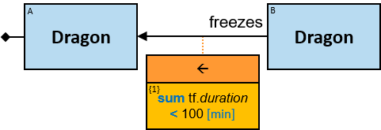

_**Q89:** Any dragon that froze dragons for more than three different durations_

_**Q167:** Any person whose owned entities are all of the same type_ (version 2)

_**Q366:** Any pair of dragons that have relationships of at least three types_ (version 2)

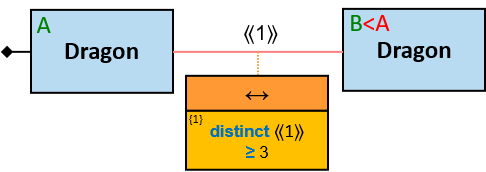

_**Q117:** Any person whose owned horses' average weight is greater than 450 Kg_

If a horse were owned twice - it would be counted only once.

_**Q116:** Any person A that the number of distinct colors of A's owned horses - is between one and three_

_distinct_ does not aggregate _null_ evaluation results. If all dragons have a _null_ color, {2} would be equal to zero.

_**Q134:** Any person A that the number of distinct colors of all horses owned by A's friends - is between one and three_

_**Q229:** Any person A that the number of distinct colors of all horses owned by A's friends and parents - is between one and three_

_**Q135:** Any person A that the average weight of all horses owned by A's friends - is greater than 450 Kg_

Note that if some person A1 is a friend of two people who jointly own a horse, this horse's weight would be counted once.

_**Q137:** Any dragon A that froze dragons B. Each B froze at least one dragon, which is not A. All these B's together froze dragons for more than 100 minutes cumulatively_

_**Q336:** For each dragon: each time it froze some dragon for a duration longer than the average duration of all its freezes_

First, any triplet (A, B, C) matching the pattern excluding the aggregator and the constraint in {2} is found. Then, {1} is evaluated per assignment to A, and then the constraint in {2} is evaluated per relationship assignment. See also Q337.

Note that a dragon that always froze dragons for the same duration is not a valid assignment to A.

_**Q354:** Any dragon that froze one dragon and fired at another dragon, or froze a dragon and fired at more than one dragon, or fired at a dragon and froze more than one dragon, and there is some dragon that the earliest time it fired at it is earlier than the earliest time if froze any other dragon_

_**Q139:** Any person A who owns horses of the same number of colors as the number of colors of the horses owned by A's parents cumulatively_

_**Q98:** Any pair of dragons (A, X) where A froze more than three dragons and (A froze X more than ten times or for a cumulative duration of more than 100 minutes)_

_**Q88:** Any pair of dragons (A, B) where the cumulative duration A froze B is equal to the cumulative duration B froze A_

A property of entity _et_ cannot be aggregated per _et_, nor per a superset of _et_.

{1} is a property of B and hence cannot be aggregated per A × B.

If entity _et_ has a property that references
* an aggregation of a property of a Cartesian product composed of _et1_, or
* an aggregation of a property of a relationship between _et_ and _et1_

then

* a property of _et_ cannot be constrained based on a property of _et1_
* a property of _et1_ cannot be constrained based on a property of _et_

In the two patterns above, {2} - a property of A, is referencing an aggregation of a property of a relationship between A and B. Therefore, a property of A cannot be constrained by a property of B. Similarly, a property of B cannot be constrained by a property of A.

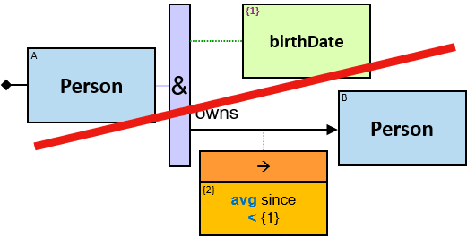

  
In the two patterns above, {2} - a property of B, is referencing an aggregation of a property of a relationship between A and B. Therefore, a property of B cannot be constrained by a property of A. Similarly, a property of A cannot be constrained by a property of B.

## Min/Max Aggregators

Sometimes we need to limit assignments to a Cartesian product of entity-tags, based on some value, to [all but] the _k_ assignments for which the value is the lowest/highest. Here are some examples:

- _Any person A and A's five oldest offspring_
- _Any dragon and the three dragons it froze the largest number of times_
- _Any dragon and the four dragons it froze for the maximal cumulative duration_

Three types are M aggregators are presented:

- M1: the value is the number of assignments to a union of Cartesian products of entity-tags
- M2: the value is the number of assignments to relationships/paths
- M3: the value is the evaluation result of an expression

M1 and M2 are syntactic sugar, which, alternatively, can be implemented by chaining A1 or A2 to an M3.

## M1 Aggregator

Let ___B___ denote a Cartesian product of one or more entity-tags. _B_ must be nonempty and must not be composed of entity-tags composing _T_.

Let ___M___ denote a list of Cartesian products of entity-tags. _M_ must be nonempty and must not be composed of entity-tags composing _B_ or _T_.

The lower part of an M1 aggregator contains the following elements:

- optional: "all but"

- _k_: positive integer

- One of the following:
  - '_et1 × et2 × ..._': _B_ = _et1_ × _et2_ × ...
  - '←': _B_ = entity-tag directly left of the aggregator
  - '→': _B_ = entity-tag directly right of the aggregator not wrapped with a negator nor preceded by a _None_ quantifier (valid only when there is exactly one such entity-tag)
  - '↔': _B = et1 × et2_, where _et1_ is the entity-tag directly left of the aggregator, and there is a single entity-tag directly right of the aggregator not wrapped with a negator nor preceded by a _None_ quantifier - _et2_

  Let ___BA(n)___ denote the list of all unique assignments to _B_ in _S(n)_. _BA(n)[o]_ is the _o'th_ assignment.

- One of the following:
  - with min
  - with max

- One of the following (_with min/max ..._):
  - '_et11 × et12 × ..._ ∪ _et21 × et22 × ..._ ∪ _..._' (all products have the same arity):

    _M_ = [_et11 × et12 × ..._ , _et21 × et22 × ..._ , _..._]
    
  - '←':

    card(_M_) = 1; _M_[1] = [_et_] where _et_ is directly left of the aggregator
    
  - '→':

    _M_ = [_et1, et2, ..._] where _et1, et2, ..._ are directly right of the aggregator and not wrapped with a negator nor preceded by a _None_ quantifier (equivalent to '_et1_ ∪ _et2_ ∪ ...')
    
  - '↔':

    _M_ = [_et × et1, et × et2, ..._] where _et_ is directly left of the aggregator and _et1, et2, ..._ are directly right of the aggregator and not wrapped with a negator nor preceded by a _None_ quantifier (equivalent to '_et × et1_ ∪ _et × et2_ ∪ ...')

  Let ___MA(n, o, p)___ denote the list of all assignments to _M[p]_ in the subset of _S(n)_ that contains _BA(n)[o]_.

  ___MC(n, o)___ = _MA(n, o, 1) ∪ MA(n, o, 2) ∪ ..._ - the set of unique assignments to elements in _M_ in the subset of _S(n)_ that contains _BA(n)[o]_.

**For each _n_: from the set of assignments in _S(n)_ - [all but] the _k_ assignments _BA(n)[k]_ with the minimal/maximal positive card(_MC(n, k)_) are reported.**

If there are only _j<k_ assignments - all those _j_ are valid assignments. If there are _j>k_ assignments with equal extremum - all those _j_ are valid assignments.

M1 location:
- Below a relationship/path

  A relationship/path with an M1 below may have a relationship/path-negator, an may be wrapped with 'O'.
  
- Below a quantifier-input (excluding quantifier at the start of the pattern)

  A quantifier-input with an M1 below may be wrapped with an 'O' (except at the pattern's start)
  
- Below the pattern's start (even when followed by a quantifier)

  See Q299v1, Q299v2, Q262.
  
- If _T_ is empty - M1 appears directly right of the leftmost entity in _B_
- If _T_ is not empty and all the entities in _T_ appear right of all the entities in _B_: left of the rightmost entity in _T_. Otherwise: right of the leftmost entity in _T_
- If entities in _T ∪ B_ are in different branches of a quantifier: directly left of the quantifier

_**Q67:** The three people with the largest number of parents_

_**Q68:** The two dragons that were frozen by the largest number of dragons_

_**Q69:** The two entities that own the largest number of entities_

_**Q70:** The five people who the number of people with a path of length up to four from each of them - is the smallest_

_**Q196:** Any **dragon** owned by Brandon Stark and the three dragons **it** froze that froze the largest number of dragons_

_**Q197:** Any person A and A's three dragons that the dragons they froze - froze the largest number of distinct dragons cumulatively_

_**Q234:** Any person and the three dragons whose dragons froze - that froze the largest number of dragons_

_**Q236:** Any person A and the three dragons whose dragons froze - that were frozen by the largest number of A's dragons_

_**Q227:** Any **dragon** owned by Brandon Stark, and the three dragons **it** froze or fired at - that froze the largest number of dragons_

_**Q238:** For any pair of people (A, D) where A's dragons froze D's dragons - A's three dragons that froze the largest number of D's dragons_

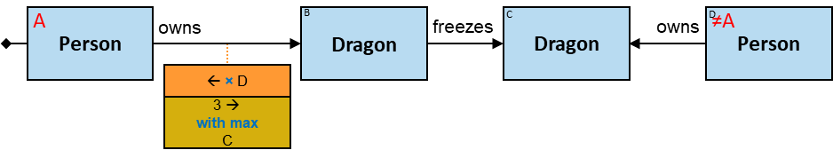

_**Q299:** For any pair of people (A, E) where at least one of A's dragons froze at least one of E's dragons - A's (up to) three dragons that cumulatively froze the largest number of E's dragons_ (two versions)

Note that the same graph-entity may be assigned to B, C, and D.

## M2 Aggregator

Let ___B___ denote a Cartesian product of one or more entity-tags. _B_ must be nonempty and must not be composed of entity-tags composing _T_.

The lower part of an M2 aggregator contains the following elements:

- optional: "all but"

- _k_: positive integer

- One of the following:
  - '_et1 × et2 × ..._': _B_ = _et1_ × _et2_ × ...
  - '←': _B_ = entity-tag directly left of the aggregator (see Q78, Q171, Q172)
  - '→': _B_ = entity-tag directly right of the aggregator not wrapped with a negator nor preceded by a _None_ quantifier (valid only when there is exactly one such entity-tag) (see Q195, Q228)
  - '↔': _B = et1 × et2_, where _et1_ is the entity-tag directly left of the aggregator, and there is a single entity-tag directly right of the aggregator not wrapped with a negator nor preceded by a _None_ quantifier - _et2_ (see Q77, Q80)

  Let ___BA(n)___ denote the list of all unique assignments to _B_ in _S(n)_. _BA(n)[o]_ is the _o'th_ assignment.

- One of the following:
  - with min ↑
  - with max ↑

  Let ___R___ denote a list where each element is a pattern-relationship/pattern-path. _R_ must be nonempty.

  When M2 appears below a relationship/path - card(_R_) = 1; _R[1]_ = the relationship/path.

  When M2 appears below a quantifier-input - each element in _R_ is the relationship/path that follows one branch of the quantifier, excluding relationships/paths wrapped with a negator or a relationship/path-negator.

  Let ___RA(n, o, p)___ denote the list of all assignments to _R[p]_ in the subset of _S(n)_ that contains _BA(n)[o]_.

  ___RC(n, o)___ = _RA(n,o,1)_ ∪ _RA(n, o, 2)_ ∪ ... - the set of unique assignments to elements in _R_ in the subset of _S(n)_ that contains _BA(n)[o]_.

**For each _n_: from the set of assignments in _S(n)_ - [all but] the _k_ assignments _BA(n)[k]_ with the minimal/maximal positive card(_RC(n, o)_) are reported.**

If there are only _j<k_ assignments - all those _j_ are valid assignments. If there are _j>k_ assignments with equal extremum - all those _j_ are valid assignments.

M2 location:
- Below the relationship/path whose assignments are counted

  A relationship/path with an M2 below it may be wrapped with an 'O'.
  
- Below a quantifier-input (except a _None_ quantifier) that assignments to relationships/paths on its right are counted

  A quantifier-input with an M2 below it:
  - may be wrapped with an 'O'
  - at least one branch of the quantifier (or subbranch of a sequence of quantifiers) must start with a relationship/path with no relationship/path-negator that is not wrapped with a negator nor preceded by a _None_ quantifier
  
_**Q78:** The four dragons that froze Balerion the largest number of times_

_**Q171:** The two dragons that were frozen the largest number of times_

_**Q172:** The five people with the smallest positive number of paths of length up to four to some person_

(Compare with Q324)

_**Q77:** The five pairs of dragons (A, B) with the largest number of times B froze A_

_**Q80:** The three pairs of people with the largest number of paths of length up to four between them_

_**Q195:** Any dragon owned by Brandon Stark and the three dragons it froze the largest number of times_

_**Q231:** Any person A and the three dragons that were frozen by dragons that were frozen the largest number of times by A's dragons_

_**Q228:** Any dragon owned by Brandon Stark that fired at at least two dragons, and the three dragons it fired the largest number of times_

(counting the number of relationships assignments directly right of the quantifier)

_**Q237:** For any pair of (A - a dragons owner, and C - a dragon that was frozen by A's dragons) - the three dragons owned by A that froze C the largest number of times_

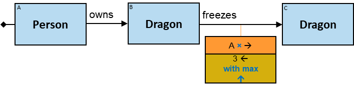

_**Q239:** For any pair of people (A, D) where A's dragons froze D's dragons - the three pairs of (A's dragon B, D's dragon C) where B froze C the largest number of times_

## M3 Aggregator

Let ___B___ denote a Cartesian product of one or more entity-tags.

The lower part of an M3 aggregator contains the following elements:

- optional: "all but"

- _k_: positive integer

- One of the following:
  - '_et1 × et2 × ..._': _B_ = _et1_ × _et2_ × ...
  - '←': _B_ = entity-tag directly left of the aggregator
  - '→': _B_ = entity-tag directly right of the aggregator not wrapped with a negator nor preceded by a _None_ quantifier (valid only when there is exactly one such entity-tag)
  - '↔': _B = et1 × et2_, where _et1_ is the entity-tag directly left of the aggregator, and there is a single entity-tag directly right of the aggregator not wrapped with a negator nor preceded by a _None_ quantifier - _et2_

  Let ___BA(n)___ denote the list of all unique assignments to _B_ in _S(n)_. _BA(n)[o]_ is the _o'th_ assignment.

- One of the following:
  - with min _expr_
  - with max _expr_

  _expr_ is an expression composed of constants, properties, and subproperties of _R_ (when M3 appears below a relationship _R_ with no relationship-negator) (see Q74), EA-tags defined on top of the aggregator (see Q91, Q274, Q306), and EA-tags defined right of the aggregator (see Q130, Q128)

  Let ___RA(n, o)___ denote the minimal/maximal assignment to _expr_ in the subset of _S(n)_ that contains _BA(n)[o]_.

**For each _n_: from the set of assignments in _S(n)_ - [all but] the _k_ assignments _BA(n)[k]_ with the minimal/maximal _RA(n, k)_ are reported.**

If there are only _j<k_ assignments - all those _j_ are valid assignments. If there are _j>k_ assignments with equal extremum - all those _j_ are valid assignments.

M3 location:
- Below a relationship/path

  When M3 appears below a relationship _R_, and _expr_ is composed of at least one property or subproperty of _R_, _R_ may be wrapped with an 'O'. Otherwise - a relationship or path with an M3 below it may have a relationship/path-negator and may be wrapped with an 'O'.

- Below a quantifier-input (excluding quantifier at the start of the pattern)

  A quantifier-input with an M3 below it may be wrapped with an 'O'.
  
- Below the pattern's start (even when followed by a quantifier)

  See Q130, Q216, Q264.
  
- If _T_ is empty - M3 appears directly right of the leftmost entity in _B_
- If _T_ is not empty and all the entities in _T_ appear right of all the entities in _B_: left of the rightmost entity in _T_. Otherwise: right of the leftmost entity in _T_
- If entities in _T ∪ B_ are in different branches of a quantifier: directly left of the quantifier

_**Q130:** The four oldest people_

_**Q131:** The four oldest males_

_**Q118:** Any person A and A's three oldest offspring_

_**Q119:** Any person A and A's three youngest sons_

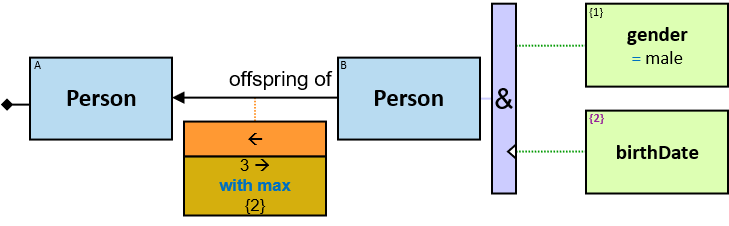

_**Q74:** Any person A and A's three horses with the minimal first ownership start date_

_**Q230:** Any person A and the three people A is a friend of or a friend of an offspring of - that own the heaviest horses_

_**Q232:** Any person A and the three heaviest horses owned by people A is a friend of or a friend of an offspring of_

## R1 Aggregator

Let ___R___ denote the relationship R1 appears below it.

The lower part of an R1 aggregator contains the following elements:

- optional: "all but"
- _k_: positive integer
- '↑' (an arrow pointing to the relationship on top of the aggregator):
- One of the following:
  - with min _relExpr_
  - with max _relExpr_

  _relExpr_ is an expression containing at least one property or subproperty of _R_

  Let ___RA(n)___ denote the list of all unique assignments to _R_ in _S(n)_. _RA(n)[o]_ is the _o'th_ assignment.

**For each _n_: from the set of assignments in _S(n)_ - [all but] the _k_ assignments _RA(n)[k]_ with the minimal/maximal _relExpr_ are reported.**

If there are only _j<k_ assignments - all those _j_ are valid assignments. If there are _j>k_ assignments with equal extremum - all those _j_ are valid assignments.

R1 location:
- Below the relationship whose property is referenced

  The relationship may be wrapped with an 'O'.

_**Q241:** The four longest freezes_

_**Q161:** For each dragon that froze at least one dragon at least once: the four longest freezes_

_**Q160:** For each pair of dragons (A, B) where A froze B at least once: The four longest freezes_

_**Q240:** For any pair of people (A, D): The four longest freezes where any of A's dragons froze any of D's dragons_

## Aggregator Chains

Relationships' expressions and aggregators can be _chained_. When chained, each relationship's expression and each aggregator with a constraint is a filtering stage. An assignment is valid only if all the chained constraints are satisfied, or in other words - if it passed all filtering stages.

Within a chain, relationships' expressions may not appear below aggregators. Also, an aggregator may not appear in a horizontal quantifier's branch. It may appear below a horizontal combiner that combines all the branches (see Q302, Q303).

_**Q96:** Any dragon Balerion froze more than ten times - each on or after January 1, 1010, and for a duration shorter than ten minutes_

Note that the order of the constraints along the chain matters: the top two constraints filter relationships based on their properties' value. The third constraint is on the number of relationships that passed these filters.

_**Q302:** Any dragon A that froze at least three dragons - each at least one time where at least two of the following conditions are satisfied: (i) the freeze duration was longer than ten minutes (ii) the freeze started after January 1, 980 (iii) the freeze ended before February 1, 980_

See Q185 for a different pattern structure that could be used.

_**Q303:** Any pair of dragons (A, B) where A froze B at least three times, each for more than ten minutes, and either the freeze started after January 1, 980 or ended before February 1, 980_

_**Q186:** Any dragon that Balerion froze more than ten times for less than ten minutes, and at least once for ten minutes or more_

_**Q99:** Any dragon that Balerion froze more than ten times for less than ten minutes, and not once for ten minutes or more_ (two versions)

_**Q94:** Any dragon that froze more than three dragons: each more than five times for more than ten minutes_

Filtering stages:

- Pass freezes longer than ten minutes
- Pass pairs of dragons (A, B) where A froze B more than five times for more than ten minutes
- Pass dragons A that froze more than three B's each more than five times for more than ten minutes 

_**Q93:** Any dragon A that froze more than three dragons - each at least five times for more than ten minutes_

(Similar to Q94, but the order of the aggregators is switched.) Filtering stages:

- Pass freezes longer than ten minutes
- Pass dragons A that froze more than three B's - each at least once for more than ten minutes
- Pass pairs of dragons (A, B) where A froze B more than five times for more than ten minutes

A dragon A that froze more than three dragons, each at least once for more than ten minutes, but froze only a single dragon more than five times for more than ten minutes - is a valid assignment in Q93 but not in Q94.

_**Q272:** Any pair of dragons (A, B) where the longest freeze duration is at least ten times longer than the shortest freeze duration_

_**Q363:** Any dragon that the latest time it froze some dragon for the first time was in or after 1010_

_**Q91:** The four dragons with the maximal (shortest duration they were frozen for)_

_**Q90:** The four pairs of dragons (A, B) where A froze B for the maximal cumulative duration_

_**Q92:** The four dragons with the maximal (average duration they froze dragons for)_

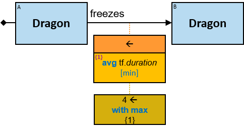

_**Q328:** The three people with the maximal cumulative horse ownership days_

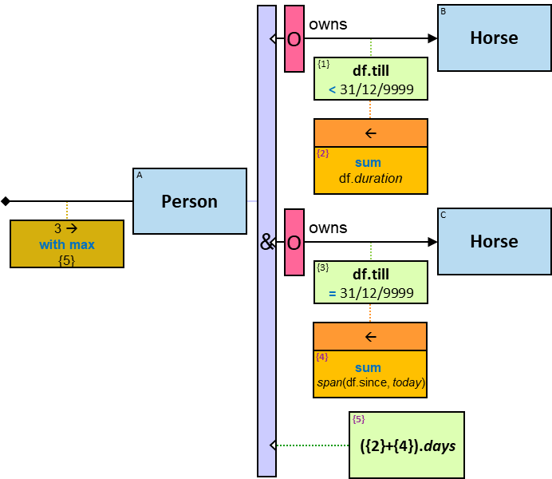

_**Q201:** For each dragon that froze at least ten dragons: the three dragons it froze for the maximal cumulative duration_

_**Q274:** The four dragons with the largest difference between (the longest duration they froze dragon for) and (the shortest duration they froze dragon for)_

_**Q182:** Any dragon owned by Brandon Stark and the three dragons it froze for the maximal cumulative duration_

_**Q133:** The four people that the average weight of their horses is maximal_

_**Q132:** The four people who own horses of the largest number of colors_

_**Q233:** Any dragon A than froze dragons Bs that froze dragons Cs, and the three Cs for which A froze Bs for the maximal cumulative duration_

_**Q138:** The four people who the people each of them is a friend of - cumulatively own horses of the largest number of colors_

_**Q183:** The three dragons that dragons owned by Brandon Stark froze for the maximal cumulative duration_

_**Q168:** The three people who the number of types of entities each of them owns is the largest_

_**Q163:** Any dragon that the average duration of the ten shortest times it froze dragons is longer than 60 minutes_

_**Q162:** Any pair of dragons (A, B) where the second shortest duration A froze B is longer than 60 minutes_

_**Q341:** For each pair of dragons (A, B): the two shortest freezes A froze B. If there are more than two freezes with equal minimal duration - the two earliest amongst them_

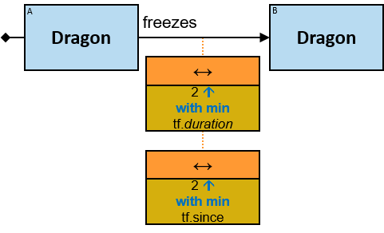

_**Q268:** Any pair of dragons (A, B) where the average duration of the 11th-20th most prolonged freezes A froze B is longer than 60 minutes_ (two versions)

_**Q120:** Any person A whose three oldest offspring's cumulative height is lower than A's height_

_**Q202:** Any person A whose three oldest offspring's average height is lower than the average height of all A's offspring_

_**Q208:** Any person whose three oldest horse-owning sons cumulatively own horses of three colors_

_**Q140:** Any person whose three oldest sons cumulatively own horses of three colors_

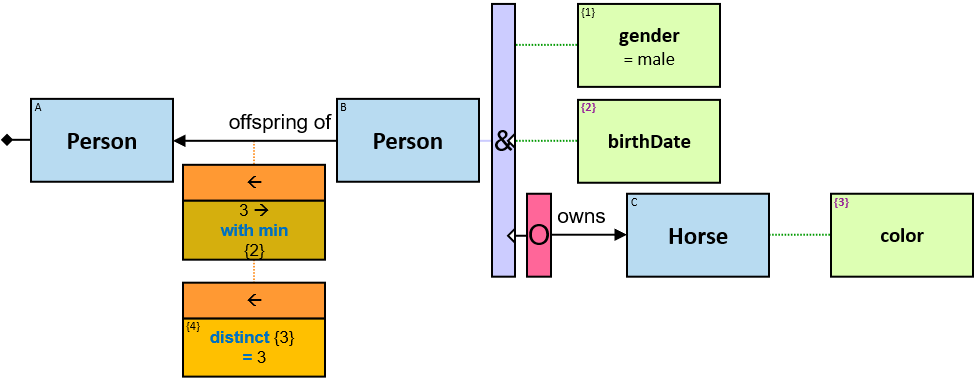

Note that {3} is defined right of an 'O' and is evaluated to _null_ when the optional part has no valid assignment. distinct does not aggregate _null_ evaluation results.  

_**Q141:** Any person A whose three oldest sons cumulatively own horses of the same number of colors as of those cumulatively owned by A's three youngest daughters_

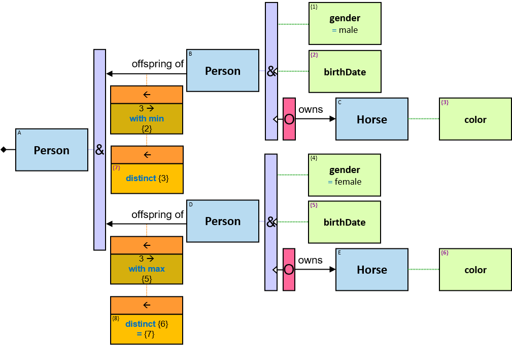

_**Q95:** Any dragon Balerion froze more than five times, each for more than ten minutes, and the total duration of those freezes was longer than 100 minutes_ (three versions)

The two _per pair_ constraints could be chained instead. The meaning would be similar:

_**Q199:** Any dragon that (froze more than ten times each of more than ten dragons) and (froze more than 20 times each of less than ten dragons)_

_**Q200:** Any dragon that (froze more than ten times each of more than ten dragons. For each of these ten dragons - the freezes had exactly two distinct durations) and (froze more than 20 times each of less than ten dragons. The average freeze duration of all these dragons - is longer than three minutes)_

_**Q277:** Any dragon that the longest (cumulative duration it froze some dragon) is more than ten times longer than the shortest (cumulative duration it froze some dragon)_

_**Q351:** Any person who owns two horses of different colors, a dragon that froze at least ten dragons of the same color as the first horse, and a dragon that froze at least ten dragons of the same color as the second horse_

_**Q320:** Any person A where there are more horses of the same colors as A's owned horses than dragons of the same colors as A's owned dragons_ (version 1)

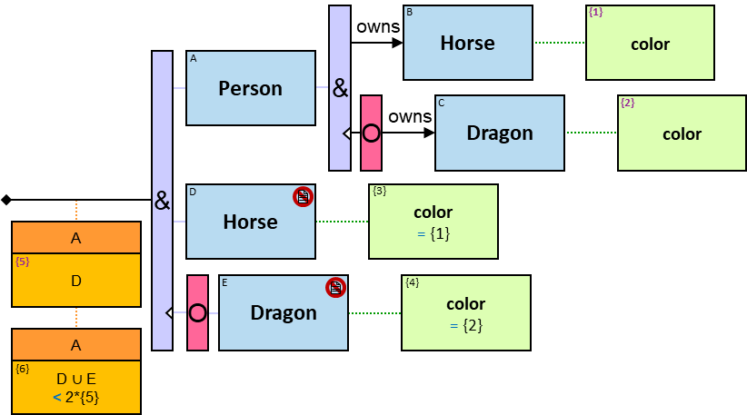

The number of assignments to E is zero when the optional part has no assignment. We cannot simply test if E < {5} since if there are zero assignments to E per A - the constraint is not satisfied.

_**Q321:** Any person A where more horses than dragons have the same name-length as a horse/dragon A owns_ (version 1)

The number of assignments to D is zero when the optional part has no assignment. We cannot simply test if D < {4} since if there are zero assignments to D per A - the constraint is not satisfied.

_**Q259:** Any person who since 1011 become an owner of no horses or up to four horses_ (two versions)

_**Q337:** For each pair of dragons: each time one of them froze the other for a duration longer than the average duration of all the freezes that are longer than the average duration one of them froze the other_

_**Q317:** Any dragon that the time difference between the earliest time it froze/fired at some dragon and the latest time it froze/fired at some dragon - is at least one year_

Note that {1}, {2}, {3} and {4} are defined right of an 'O', hence evaluated to _null_ when the optional part has no assignment. Since _min_({...}) and _max_({...}) ignore _nulls_, the pattern would yield the expected results even when dragon A froze no dragon or when dragon A fired at no dragon.

_**Q377:** Any dragon and the three earliest times it froze/fired at some dragon_

## Aggregator Sequences

Multiple aggregators may appear along a _sequence_. Along a sequence, aggregator's constraints are evaluated from right to left, except where a constraint depends on the evaluation result of a constraint on its left (see Q376).

_**Q128:** Any person A and A's three offspring who own horses of the largest number of colors_

_**Q198:** Any person A and A's three dragons that (for each of them: the four dragons it froze that froze the largest number of dragons) - froze the largest number of distinct dragons cumulatively_

_**Q179:** Any pair of dragons (A, B) where A froze B for a cumulative duration longer than the cumulative duration B froze dragons_ (two versions)

_**Q103:** Any dragon A that froze at least three dragons, each of which was frozen by at least four dragons other than A_

_**Q106:** Any dragon A that froze dragons at least three times - each was frozen at least four times by dragons other than A_

_**Q164:** Any dragon that the number of times dragons it froze have frozen dragons (cumulatively) - is equal to the number of times dragons it fired at have fired at dragons (cumulatively)_

_**Q356:** The average number of horse ownerships per person_

_**Q324:** The five people with the smallest number (including zero) of paths of length up to four to some person_

(Compare with Q172)

_**Q107:** Any **dragon** that (the number of dragons, each owned by five people, that froze **it**) is five, and that the number of times **it** was frozen by those dragons (cumulatively) is not five_

_**Q169:** Any person A who (has at least one offspring who owns at least three horses) and (each of A's offspring who owns at least three horses - owns horses of at least three colors)_

_**Q129:** Any person A that (each of A's offspring who owns at least one horse - owns a different number of horses)_

_**Q181:** Any dragon with no intersection between the groups of dragons frozen by any two dragons it froze_

_**Q213:** Out of the pairs of dragons (A, B) where A froze B for a cumulative duration longer than the cumulative duration B froze dragons - the five pairs with the largest number of times A froze B_

When the order of the aggregators along the chain is switched, the meaning changes: 

_**Q376:** Out of the five pairs of dragons (A, B) with the largest number of times A froze B – the pairs where A froze B for a cumulative duration longer than the cumulative duration B froze dragons_

Since {2} has a constraint that depends on the evaluation of {1}, {1} must be evaluated first. However, the M2 aggregator filters (A, B) pairs before {1} is evaluated.

_**Q191:** Any dragon that froze dragons S and fired at dragons T. &#124;S&#124;≥3, &#124;T&#124;≥3 and &#124;S∪T&#124;≥10_

_**Q192:** Any dragon that froze dragon m≥3 times and fired at dragons n≥3 times. m+n≥10_

_**Q193:** Any dragon that froze dragons S, fired at dragons T, and fired ≥3 times. &#124;S&#124;≥3 and &#124;S∪T&#124;≥10_

_**Q194:** Any dragon that froze dragons m times, fired at dragons n≥3 times, and froze ≥3 dragons. m+n≥10_

_**Q97:** Any dragon that froze more than three dragons - each more than ten times or for a cumulative duration of more than 100 minutes_

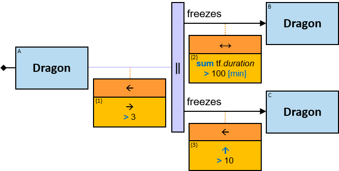

_**Q180:** Any pair of dragons (A, B) where the cumulative duration A and B froze each other - is longer than both the cumulative duration A froze other dragons and the cumulative duration B froze other dragons_

_**Q347:** The five dragon triplets with the largest number of times triplet-members froze one another_

Note that we need to count each triplet only once (ignoring permutations).

_**Q100:** Any dragon that Balerion froze more than ten times for less than ten minutes, more than ten times on or after January 1, 1010, more than 15 times for less than ten minutes or on or after January 1, 1010, and more than 100 times altogether_

## Extended Aggregators

For extended aggregators, _T_ denotes an _extended Cartesian product_ - a Cartesian product not just of entity-tags but of

* Zero or more entity-tags
* Zero or more expressions, each can be either
  * an inherent property of the attached relationship
  * an EA-tag
* Zero or more entity type-tags
* Zero or more relationship type-tags

Hence, for all extended aggregator types (A1, A2, A3, M1, M2, M3, and R1), the _per_ clause has the following format:

- '_et1 × et2 × ... × expr1 × expr2 × ... ×_ ⟨ _ett1_ ⟩ _×_ ⟨ _ett2_ ⟩ _× ... ×_ ⟪ _rtt1_ ⟫ _×_ ⟪ _rtt2_ ⟫ _× ..._:

  _T_ = _et1 × et2 × ... × expr1 × expr2 × ... ×_ ⟨ _ett1_ ⟩ _×_ ⟨ _ett2_ ⟩ _× ... ×_ ⟪ _rtt1_ ⟫ _×_ ⟪ _rtt2_ ⟫ _× ..._
    
Wherever possible, the notations '←', '→' and '↔' are used instead of entity-tags.

For all extended M aggregators (M1, M2, and M3), the same is true also for _B_.

Here are two examples:

First example: _Any person who at a certain date became an owner of more than five horses_ (Q115v2)
 

{1} is evaluated per each unique assignment to A × _df_._since_ in _S_.  In other words, {1} is a property of each unique assignment to A × _df_._since_ in _S_.

Second example: _For each color of dragons that Balerion froze - the three dragons it froze the largest number of times_ (Q215)
 

## Extended A1 Aggregator

_**Q261:** Any color of which there are at least ten horses_

{2} is a property of each unique assignment to {1} in _S_.

_**Q115:** Any person who at a certain date became an owner of more than five horses_ (two versions)

{1} is a property of each unique assignment to A × _df_._since_ in _S_.

_**Q289:** Any person who at a certain three-day interval became an owner of more than five horses_

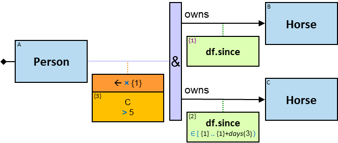

When _n_ intervals overlap, the intersection contains the start-time of at least one of the intervals (it also contains the end-time of at least one of the intervals).

_**Q283:** Any person who at a certain day owned at least five horses_

_**Q284:** Any person who owned the same five horses - for at least ten consecutive days_ (version 1)

_**Q378:** Any relationship-type that holds between more than 1000 pairs of dragons_

_**Q217:** Any dragon and the dragons it froze - on days it froze between one and five dragons_

_**Q114:** Any person who owns at least five horses of the same color_ (version 3)

_**Q218:** Any person who owns at least five entities of the same type_ (version 2)

_**Q157:** Any person who owns between one and three horses of the same color - for at least six colors_

_**Q214:** Any person who owns entities of at least four types. For each type - at least five entities_

_**Q235:** Any dragon that the number of dragons it froze on average - on months it froze dragons in - is at least ten_

_**Q153:** Any dragon A that in each of at least 11 days - froze between one and five dragons_

_**Q252:** Any dragon B that in each of at least 11 days - was frozen by a dragon that on that day froze between one and five dragons_

_**Q255:** Any dragon whose name-length is equal to the number of days in each of which it froze ten dragons_

_**Q278:** Any pair of dragons (A, B) that in each of at least 11 days - A froze between one and five dragons, one of them is B_

_**Q254:** Any dragon that in each year it froze dragons - it froze more than three dragons_

_**Q306:** The three dragons that the number of days in each of which each froze at least five dragons - is maximal_

_**Q285:** Any person who at a certain day owned at least five horses and at least five dragons_

_**Q286:** Any person who at each day of at least ten (not necessarily consecutive) days - owned at least five horses (not necessarily the same horses each day)_

_**Q158:** Any dragon that in each of at least ten days - the number of dragons it froze is greater than the number of dragons that froze it_

Note the location of {6}. If it was below {1}, the evaluation order was different. As it is, {6} counts distinct assignments to {1} for which the _All_ quantifier was satisfied.

_**Q260:** Any dragon that in each of at least ten days: (i) the number of dragons it froze is greater than the number of dragons that froze it, and (ii) it froze/was frozen at least five times_

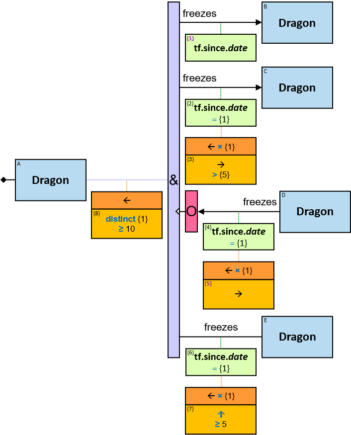

_**Q350:** Any pair of people who own the same number of entities of each type_

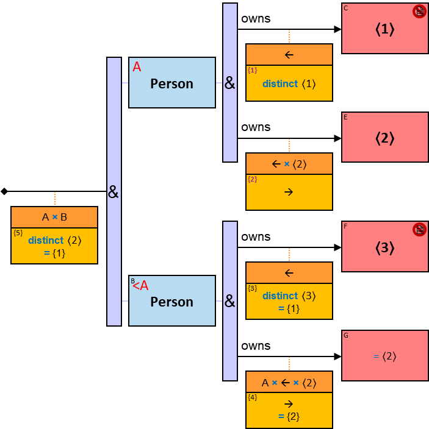

_**Q332:** Any person whose horses are all of rare colors. A rare color is a color of less than 1% of the horses_ (two versions)

_**Q338:** Any person who owns at least ten horses, at least half of which are of rare colors. A rare color is a color of less than 1% of the horses_ (two versions)

## Extended A2 Aggregator

_**Q330:** Any day during which more than five horse-ownerships started_

_**Q270:** Any person A and A's horses of the colors for which there are more than five horse-ownerships by a person_

## Extended A3 Aggregator

_**Q331:** Any day during which the horse ownerships that started lasted on average for at least ten years_

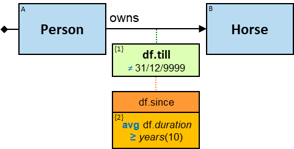

_**Q271:** Any person A and A's horses of the colors for which the average ownership start date is at least January 1, 1010_

_**Q263:** Any horse of each color of which the average horses' weight is greater than 450 Kg_

_**Q265:** Any horse  of each color of which the average horses' owners' height is at least 180 cm_

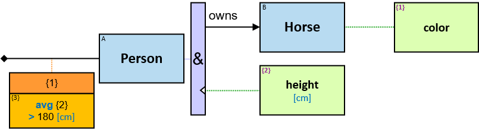

_**Q155:** Any dragon that in each of at least 11 days - froze dragons for more than 100 minutes cumulatively_

_**Q156:** Any dragon that froze dragon for more than 1000 minutes cumulatively - in the days it froze dragons for more than 100 minutes_

_**Q154:** Any dragon that in each of at least four years - in each of at least 11 days - froze between one and five dragons_

_**Q159:** Any **dragon** for which there are more days where (it froze/was frozen at least five times, and the number of dragons **it** froze is greater than the number of dragons that froze **it**) than days where (it froze/was frozen at least five times, and the number of dragons that froze **it** is greater than the number of dragons **it** froze)_

(Compare with Q260)

_**Q361:** Any person A who owns horses of at least five colors, and the sets of weights of A's horses of each of these colors are identical_

_**Q320:** Any person A where there are more horses of the same colors as A's owned horses than dragons of the same colors as A's owned dragons_ (version 2)

_**Q321:** Any person A where more horses than dragons have the same name-length as a horse/dragon A owns_ (version 2)

## Extended M1 Aggregator

_**Q220:** Any person A and A's horses of the three colors of which A owns the largest number of horses_

_**Q262:** Any horse of the three most common horse colors_

_**Q224:** Any person A and A's horses of the three colors with the smallest positive number of horse owners_ (two versions)

_**Q342:** The three colors for which the number of pairs of dragons of that color where at least one of them froze the other - is maximal_ (version 1)

Note that if a pair of dragons mutually froze each other - we need to count this pair only once.

_**Q343:** The three color-pairs (1, 2) for which the number of dragon pairs where a dragon of color 1 froze a dragon of color 2 is maximal_

_**Q251**: The three pairs (person, color) with most horses of this color owned by that person_

_**Q211:** For each total number of freezes by a dragon: the three dragons that froze the largest number of dragons_

_**Q212:** The three most common total number of freezes by a dragon_

_**Q325:** For each of the three most common horse colors: the three people who own the largest number of horses of this color_

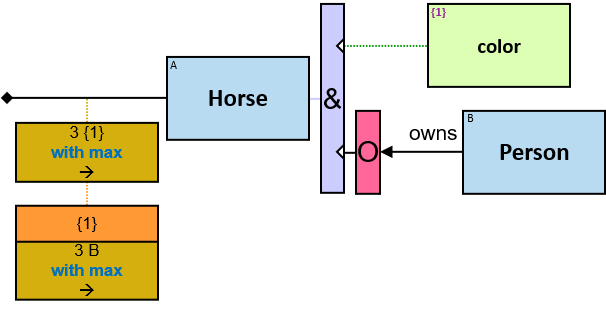

_**Q326:** For the three most common horse colors (combined): the three people who own the largest number of horses of these colors_

## Extended M2 Aggregator

_**Q215:** For each color of dragons that Balerion froze - the three dragons it froze the largest number of times_

_**Q221:** Balerion and the dragons it froze - of the three colors it froze dragons the largest number of times_

_**Q280:** Any dragon and the dragons it froze - of the three colors it froze dragons the largest number of times_

_**Q253:** For each number of dragon's owners - the three dragons Balerion froze the largest number of times_

_**Q225:** Any person A and A's horses of the three colors with the smallest positive number of horse ownerships by a person_

_**Q281:** Any dragon and the dragons it froze - of the three colors of which dragons were frozen the largest number of times_

_**Q319:** Any dragon and the dragons it froze - of the 4th-6th colors of which dragons were frozen the largest number of times_ (two versions)

_**Q282:** Balerion and the dragons it froze - of the three colors of which dragons were frozen the largest number of times_

_**Q209:** The three most owned entity-types_

_**Q210:** The three pairs (owner entity-type, owned entity-type) with most _owns_ relationships_

_**Q369:** The three most common relationship-types and the number of relationships of each of these types_

_**Q370:** The most common relationship-type between entities of the same type_

## Extended M3 Aggregator

_**Q275:** Any person A and A's horses of the three colors of which A owns the heaviest horse_

Even if A's three heaviest horses are of the same color, we would still get all A's horses for two more colors (those with the next heaviest horses)

_**Q223:** Any person A and A's horses of the three colors for which the cumulative weight of A's horses is maximal_

_**Q269:** Any person A and A's horses of the three colors for which the average ownership start date is the latest_

_**Q276:** Any person A and A's horses of the three colors for which the earliest horse ownership start date is the earliest_

Even if the three horses with the earliest ownership start date are of the same color, we would still get all people and their horses of two more colors (of the next-earliest ownership start dates)

_**Q222:** Any person A and A's horses of the three colors for which A's average ownership start date is the latest_

_**Q216:** Any dragon that Balerion froze during the three 30-day timeframes during which it froze dragons the largest number of times_

_**Q373:** The three 30-day timeframes during which dragons were frozen the largest number of times_

_**Q374:** The three most prolonged timeframes during which no dragon was frozen_

_**Q264:** Any horse of the three colors of which the average horses' weight is maximal_

_**Q226:** Any person A and A's horses - of the three horse-colors for which the average height of the horse owners is minimal_

_**Q342:** The three colors for which the number of pairs of dragons of that color where at least one of them froze the other - is maximal_ (versions 2, 3)

Note that if a pair of dragons mutually froze each other - we need to count this pair only once.

## Extended R1 Aggregator

_**Q273:** For each horse color - the three horse-ownerships with the latest ownership start date_

## Multivalued Functions and Expressions

A _multivalued function_ is a function that may associate zero or more values to each input. In V1, expressions composed of multivalued functions are evaluated separately for each output associated with the input. 

V1 supports the following multivalued functions:

* _el_: _St_ ⇉ _t_ - associates a set with each of its elements
* _el_: _Bt_ ⇉ _t_ - associates a bag with each of its elements
* _subset_: _St_ ⇉ _St_ - associates a set with each of its nonempty subsets
* _subbag_: _Bt_ ⇉ _Bt_ - associates a bag with each of its nonempty subbags

All these multivalued functuions have no associations when the input is an empty set or bag.

In the following examples, _Person_ has the following property: _nicknames_: _set(string)_.

_**Q379:** Any person who has at least one nickname_

Even though {1} has no explicit constraints, it must have at least one assignment.

_**Q307:** Any person who has a nickname containing an 'a'_

{1} is a _multivalued expression_. For each person, {1} is evaluated for each nickname. If at least one nickname satisfies the constraint - this person is a valid assignment.

_**Q316:** Any pair of people with a common nickname_

{1} is evaluated for each non-null nickname of A. {2} is evaluated for each non-null nickname of B. All combinations are evaluated.

_**Q308:** Any person who has a nickname containing both (an 'a' or an 'A') and (a 'b' or a 'B')_ 

For each person, {1} is evaluated for each non-null nickname. {2} and {3} are evaluated for each value of {1}. If {2} and {3} satisfies the constraints for at least one evaluation of {1} - the person is a valid assignment. A person with no non-null nicknames will not be evaluated.

_**Q309:** Any person who has at least two nicknames_ (two versions)

The _count_ function returns the number of values a multivalued expression has. {1} is a single-valued expression.

An A3 aggregator can be used for aggregating the evaluations of a multivalued expression:
- The aggregator appears below an _All_ quantifier-input
- The per clause is '←'
- There are only entity's expressions right of the quantifier
- There is exactly one multivalued expression right of the quantifier

{2} is assigned with the number of distinct non-null evaluations of {1}.

_**Q310:** Any person who has at least two nicknames - each contains an 'a'_ (two versions)

_**Q311:** Any person who has at least five nicknames - each contains either an 'a' or a 'b'_

_**Q312:** Any person with more nicknames containing a 'b' or a 'B' than nicknames containing an 'a' or an 'A'_

Note that if a nickname contains both an 'a' and a 'b' - it would be assigned to both {1} and {4}.

_**Q313:** Any person A that has at least one nickname and all A's nicknames contain an 'a'_

_**Q314:** Any person who has at least one nickname, but none of its nicknames contain an 'a'_

_**Q315:** Any person A that the average length of A's three shortest nicknames is at least three_

_**Q348:** Any person A that the combined weight of three, four or five of A's horses - is exactly 1000 Kg_

_**Q349:** Any person A that A's horses can be split into three groups with an identical combined weight_

Relationships may have multivalued expressions as well.

_**Q284:** Any person who owned the same five horses - for at least ten consecutive days_ (version 2)

The _set_ function returns a set of all individual dates within the _tf_ dateframe. _el_ is a single element of this set (a single date). Each value is evaluated separately.

_**Q340:** Any person who owned the same five horses - in at least ten (not necessarily consecutive) days_

{2} and {5} are sets of all horse ownership dates, aggregated over all 'owns' relationships.

Expression-tag {3} represents one subset of set expression {2}. The constraint in {4} limits assignments to {3} to subsets of {2} with exactly ten elements. {2}, {3} and {4} are properties of A × B.

_**Q287:** Any person who at each day of at least ten (not necessarily consecutive) days - owned the same two horses_

_**Q327:** Any person who at each day of at least ten consecutive days - owned at least five horses (not necessarily the same horses each day)_

_**Q318:** Any dragon that Balerion froze/fired at during the three 30-day timeframes during which it froze/fired at dragons the largest number of times_

Note that {1} and {2} are defined right of an 'O', hence evaluated to an empty set when the optional part has no assignment. Since _s_ ∪ ∅ = _s_, the pattern is valid even if Balerion froze no dragon or if it fired at no dragon.

{3} is a property of A, but, being an aggregated multivalued expression, must be defined right of the aggregator.

_**Q371:** Any dragon that Balerion froze/fired at during the three **non-overlapping** 30-day timeframes during which it froze/fired at dragons the largest number of times_

{1}, {2} and {3} are sets of intervals of _datetimeframe_. In {5}, {3} is coerced to set of _datetimeframes_. {4} and {5} limit assignment to {3} to sets with three non-overlapping members.

{6} is a multivalued expression evaluated per each value of the multivalued expression {3}. The M2 aggregator is evaluated for all assignments to {6} of each assignment to {3}.

## Application: Spatiotemporality

Dragon-spotting is a major hobby around the world. Dragon-spotters document the time, location, and of course - the identity of the dragon they spotted. The location may be a point (longitude and latitude) or a small area - when they are not sure about the exact coordinates. Most observations are attributed to the spotter, but in many ancient documents - the dragon-spotter is unknown.

We will extend our sample schema with the following relationship-type:

* _spotted_: {(_Person_, _Dragon_), (_Null_, _Dragon_)} - _time_: _datetime_, _loc_: _location_

_spotted_ is a relationship between a dragon-spotter (which may be unknown) and the dragon spotted. The properties of the relationship are the time and the location where the dragon was spotted.

___location___ is an _opaque data type_ (see above) that contains a geographic point (e.g., latitude and longitude) or a geographic shape (a circle, an ellipse, a polygon, etc.)

Functions over _location_ expressions:

* _dist_(_location_, _location_) → _float_   - the distance [Km] between these two locations
  
Constraint operators over _location_ expressions:

* ⊃ _l_, ⊇ _l_, ⊅ _l_, ⊉ _l_   - [not] [proper] superspace of _l_
* ⊂ _l_, ⊆ _l_, ⊄ _l_, ⊈ _l_   - [not] [proper] subspace of _l_

Two entity-types are defined as well:

* **Landmark** - loc: _location_
* **City** - loc: _location_

Note that we chose to hold the location of stationary entities (landmark, city) as entity properties, and hold the location of mobile entities (dragon) as relationship properties.

_**G1:** Any dragon observed at Dragonmont Peak_

_**G2:** Any dragon observed within 5 Km from Dragonmont Peak_

_**G3:** Any dragon observed within 5 Km from Dragonmont Peak at least five times during a 7-day period_

_**G4:** Any dragon observed within 5 Km from Dragonmont Peak between 4 AM and 7 AM in at least five days during a 7-day period_

_**G5:** Any dragon observed within 5 Km from Dragonmont Peak in at least five separate weeks_

_**G6:** Any week during which at least five dragons were observed within 5 Km from Dragonmont Peak_

_**G7:** Any dragon with conflicting observations (given that dragons cannot fly faster than 300 Km/h)_

_**G8:** Any Sarnorian B for whom at least three of B's dragons were spotted within 5 Km from Dragonmont Peak - in a timeframe of 24 hours_

_**G9:** Any dragon that stayed within 5 Km from Dragonmont Peak for at least one week (To ensure this - the dragon should have been spotted there at least once per 6 hours and not spotted at any other location throughout that period)_

_**G10:** Any pair of dragons that were spotted within 5 Km from each other at least five observation-pairs (To ensure this - paired observation should differ in up to 5 minutes; observation pairs should differ in at least 24 hours)_

_**G11:** Any pair of dragons A and B, where at least ten times in the last 300 days A was spotted at a distance of less than 1 Km from places where B was spotted between one day and five days before_

_**G12:** Any pair of dragons that were spotted within 5 Km from each other at least 5 observation-pairs during a 30-day period (To ensure this - paired observation should differ in up to 5 minutes; observation pairs should differ in at least 24 hours)_

_**G13:** Any Sarnorian E whose dragons seem to "spy" on Balerion (at least one of E's dragons was spotted at most 1 Km from Balerion throughout a ten-day period. Paired observation should differ in up to 5 minutes; observation pairs should differ in no more than 1 hour)_

_**G14:** Any pair of dragons that were spotted not less than 1000 Km from each other throughout a period of at least one year (To ensure this - paired observation should differ in up to 30 minutes; observation pairs should differ in no more than 24 hours)_

_**G15:** Any landmark where at least five dragons were spotted within 5 Km from it_

_**G16:** Any city in which at least five dragons were spotted throughout a 2-minutes period_

_**G17:** Any landmark where at least five dragons were spotted within 5 Km from it throughout a 7-day period_

_**G18:** Any dragon spotted in at least ten cities_

_**G19:** Any dragon spotted in at least ten cities throughout a ten-day period_

_**G20:** Any dragon that traveled at least 2000 Km in a 24-hours period_

_**G21:** Any dragon-spotter that spotted the same dragon at two locations - at least 1000 Km apart_

